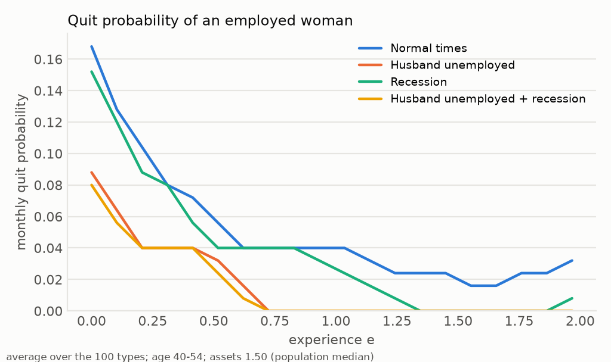
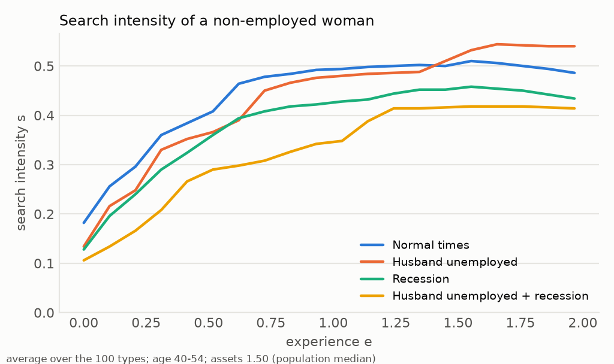
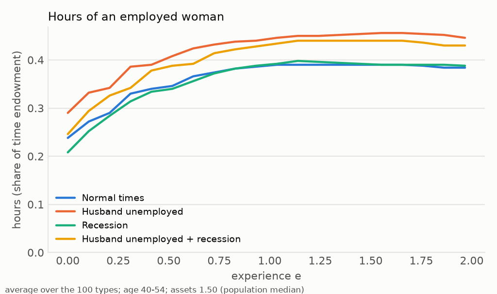
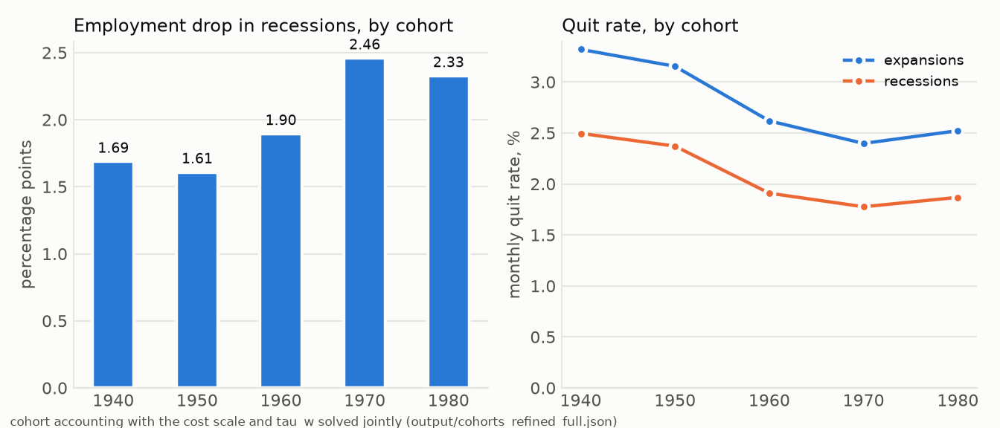
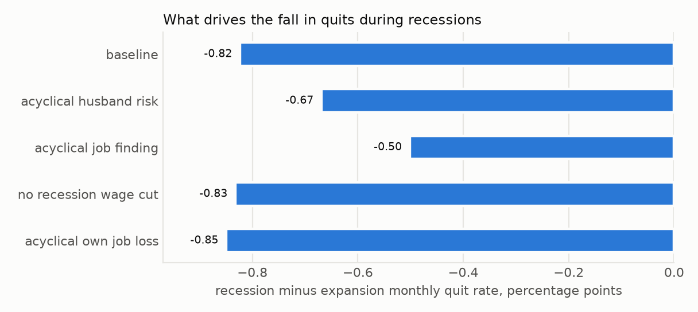
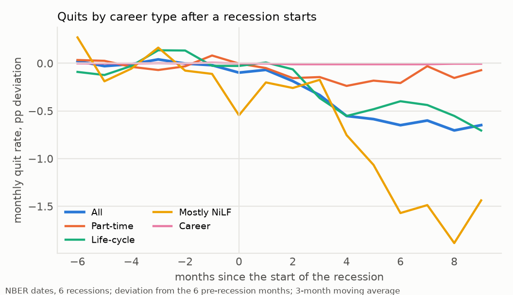

# Final model results: 1940s cohort calibration, trend experiments, mechanism

All numbers are produced by scripts in `Code26/python/scripts`; the files cited are in `Code26/python/output`. Model specification: `FINAL_MODEL.md`.

## 1. Calibration of the 1940s cohort

Source: `output/final_calib_ls_full.json` (objective 0.120, 50 evaluations, 100 types).

Least-squares polish (`scripts/calibrate_ls.py`, scipy trust-region reflective with bounds, finite-difference Jacobian on a common simulation seed) of the Nelder-Mead point `output/final_calib_full.json` (objective 0.149). The polish matches the quit rates, hours and the recession employment drop more closely and gives up on the never-working and career shares, which the identification section below shows cannot be moved together with the employment rate.

| parameter | value |
|---|---|
| mu | 0.9289 |
| kbar_max | 0.0161 |
| km_max | 6.1120 |
| tau_w | 0.7493 |
| lam_f0 | 0.4011 |
| lam_u0 | 0.0169 |
| lam_u1 | 0.0200 |
| ybar_h | 0.0583 |
| sd_kT | 0.2919 |
| home_young_mult | 1.8226 |
| nu_h | 0.6875 |
| z_h | 0.4528 |
| alpha_h | 0.2492 |
| e_max | 1.9665 |
| kappa_h_power | 0.2873 |

| target | data | model | deviation |
|---|---|---|---|
| E/pop | 0.6200 | 0.6641 | +7.1% |
| hours|E | 0.4000 | 0.4097 | +2.4% |
| share Lifecycle | 0.3100 | 0.3085 | -0.5% |
| share PT | 0.2800 | 0.2502 | -10.6% |
| share Career | 0.1900 | 0.1719 | -9.5% |
| share NiLF | 0.2200 | 0.2694 | +22.4% |
| quit/m exp | 0.0340 | 0.0332 | -2.4% |
| quit/m rec | 0.0280 | 0.0250 | -10.9% |
| E->nonE/m exp | 0.0500 | 0.0505 | +1.0% |
| E->nonE/m rec | 0.0480 | 0.0447 | -6.8% |
| dE/pop rec-exp (pts) | -1.7000 | -1.6887 | +1.1% |
| wage gap (hourly ratio) | 0.7100 | 0.7382 | +4.0% |

| untargeted moment | model |
|---|---|
| U rate | 0.0447 |
| wife share exp | 0.3319 |
| wife share rec | 0.3383 |
| HH income rec/exp - 1 (%) | -15.0947 |
| cons drop at H job loss exp (%) | -5.0741 |
| cons drop at H job loss rec (%) | -7.2569 |
| mean assets/monthly HH inc | 1.4074 |
| share e at cap | 0.2448 |

### 1a. Persistent cost-of-work shock: calibration side by side

Source: `output/final_calib_rho_coarse.json` (objective 0.238, 120 evaluations, calibrated on 27 types, moments below re-evaluated on the 100-type grid; fixed fields {'n_kT': 3.0}). The shock keeps its value from one month to the next with probability rho_kT (0 in the iid model); see `FINAL_MODEL.md`.

| parameter | iid shock | persistent shock |
|---|---|---|
| alpha_h | 0.2492 | 0.2925 |
| e_max | 1.9665 | 1.6089 |
| home_young_mult | 1.8226 | 1.6673 |
| kappa_h_power | 0.2873 | 0.3100 |
| kbar_max | 0.0161 | 0.0057 |
| km_max | 6.1120 | 6.4321 |
| lam_f0 | 0.4011 | 0.3965 |
| lam_u0 | 0.0169 | 0.0226 |
| lam_u1 | 0.0200 | 0.0262 |
| mu | 0.9289 | 0.8380 |
| nu_h | 0.6875 | 0.6652 |
| sd_kT | 0.2919 | 0.3021 |
| tau_w | 0.7493 | 0.7801 |
| ybar_h | 0.0583 | 0.0663 |
| z_h | 0.4528 | 0.4354 |
| rho_kT | - | 0.5904 |

| target | data | iid shock | persistent shock |
|---|---|---|---|
| E/pop | 0.6200 | 0.6641 (+7%) | 0.6592 (+6%) |
| hours|E | 0.4000 | 0.4097 (+2%) | 0.4454 (+11%) |
| share Lifecycle | 0.3100 | 0.3085 (-0%) | 0.2963 (-4%) |
| share PT | 0.2800 | 0.2502 (-11%) | 0.2631 (-6%) |
| share Career | 0.1900 | 0.1719 (-10%) | 0.1929 (+2%) |
| share NiLF | 0.2200 | 0.2694 (+22%) | 0.2477 (+13%) |
| quit/m exp | 0.0340 | 0.0332 (-2%) | 0.0327 (-4%) |
| quit/m rec | 0.0280 | 0.0250 (-11%) | 0.0252 (-10%) |
| E->nonE/m exp | 0.0500 | 0.0505 (+1%) | 0.0557 (+11%) |
| E->nonE/m rec | 0.0480 | 0.0447 (-7%) | 0.0510 (+6%) |
| dE/pop rec-exp (pts) | -1.7000 | -1.6887 (+1%) | -2.0625 (-36%) |
| wage gap (hourly ratio) | 0.7100 | 0.7382 (+4%) | 0.7490 (+5%) |

| untargeted moment | iid shock | persistent shock |
|---|---|---|
| U rate | 0.0447 | 0.1180 |
| wife share exp | 0.3319 | 0.3521 |
| cons drop at H job loss exp (%) | -5.0741 | -4.6244 |
| cons drop at H job loss rec (%) | -7.2569 | -6.9890 |
| mean assets/monthly HH inc | 1.4074 | 1.4726 |

### 1b. Identification: local elasticities of the targeted moments

Source: `output/jacobian_final.json` (`scripts/jacobian_final.py`; one-sided +5% steps on the 100-type grid, common simulation seed). Entries are the percent change of the moment per percent change of the parameter; for the recession employment drop, percentage points per percent. Entries of at least 0.5 in absolute value are in bold.

| parameter | E/pop | hours | LC | PT | Career | NiLF | quit exp | quit rec | E->N exp | E->N rec | dE (pts) | wage gap |
|---|---|---|---|---|---|---|---|---|---|---|---|---|
| mu | -0.22 | -0.47 | **-1.95** | **+3.95** | **-3.59** | **+0.96** | **+0.80** | **+0.80** | **+0.52** | +0.45 | +0.00 | -0.06 |
| kbar_max | -0.09 | -0.01 | +0.37 | -0.26 | **-0.68** | +0.30 | +0.28 | +0.24 | +0.18 | +0.13 | +0.02 | -0.02 |
| km_max | -0.04 | +0.00 | +0.27 | +0.03 | **-0.57** | +0.05 | +0.10 | +0.09 | +0.06 | +0.05 | +0.01 | -0.03 |
| tau_w | **+0.94** | **+0.64** | +0.30 | **-0.69** | **+4.75** | **-3.03** | **-2.98** | **-3.44** | **-1.92** | **-1.90** | +0.04 | **+1.11** |
| lam_f0 | +0.03 | -0.05 | **+1.59** | **-2.78** | -0.18 | **+0.98** | **+1.85** | **+1.57** | **+1.17** | **+0.85** | -0.01 | -0.01 |
| lam_u0 | -0.09 | +0.00 | -0.32 | +0.46 | -0.48 | +0.26 | +0.15 | +0.05 | +0.43 | +0.05 | +0.04 | -0.01 |
| lam_u1 | -0.03 | +0.00 | -0.03 | +0.10 | -0.16 | +0.05 | +0.03 | +0.12 | +0.02 | **+0.52** | -0.05 | +0.00 |
| ybar_h | -0.13 | -0.07 | -0.07 | +0.00 | **-0.59** | +0.50 | +0.37 | +0.47 | +0.24 | +0.27 | +0.00 | -0.01 |
| sd_kT | -0.23 | -0.02 | **+1.21** | **-2.34** | **-0.73** | **+1.38** | **+1.69** | **+1.60** | **+1.08** | **+0.88** | -0.01 | +0.01 |
| home_young_mult | -0.24 | -0.13 | **+2.51** | -0.23 | **-4.05** | +0.14 | **+0.88** | **+0.96** | **+0.57** | **+0.52** | +0.03 | -0.24 |
| nu_h | -0.42 | -0.13 | -0.40 | +0.33 | **-1.55** | **+1.23** | +0.49 | **+1.05** | +0.33 | **+0.58** | -0.00 | +0.01 |
| z_h | **-0.79** | -0.49 | **-0.66** | **+1.09** | **-4.75** | **+3.06** | **+2.58** | **+3.22** | **+1.66** | **+1.75** | -0.03 | -0.11 |
| alpha_h | +0.04 | -0.00 | +0.11 | +0.23 | -0.27 | -0.16 | -0.09 | -0.19 | -0.06 | -0.11 | +0.01 | -0.02 |
| e_max | +0.06 | +0.16 | -0.04 | -0.46 | **+0.82** | -0.08 | -0.19 | -0.18 | -0.13 | -0.10 | +0.00 | +0.22 |
| kappa_h_power | +0.01 | -0.02 | -0.03 | +0.08 | -0.07 | +0.00 | +0.02 | +0.02 | +0.02 | +0.01 | +0.00 | -0.01 |
| lam_f_ratio | +0.02 | -0.01 | +0.21 | -0.36 | +0.00 | +0.11 | +0.12 | **+0.71** | +0.08 | +0.38 | +0.08 | -0.00 |

The never-working share is the lowest wage-type cell of the five-point grid (20% of women, mean 140-180 hours a year, all classified as never working) plus the part of the second cell (mean 450-680 hours) that averages under 400 hours; simulation-seed noise in the four career shares is under 1 point (`output/diag_careers.json`, `scripts/diag_careers.py`).

## 2. Single-factor experiments sized to the 1970s employment rate

Source: `output/final_results_ls.json`. Scales: returns to experience x1.398, compensated wage gap x1.080 (husband income scaled to keep household income constant at baseline behaviour), cost of work x0.100.

| moment | baseline | RoE x1.40 | comp. wage gap x1.08 | cost x0.10 |
|---|---|---|---|---|
| E/pop | 0.6641 | 0.7307 | 0.7282 | 0.7210 |
| hours|E | 0.4097 | 0.4401 | 0.4354 | 0.4162 |
| U rate | 0.0447 | 0.0464 | 0.0454 | 0.0450 |
| quit/m exp | 0.0332 | 0.0225 | 0.0225 | 0.0247 |
| quit/m rec | 0.0250 | 0.0167 | 0.0165 | 0.0179 |
| E->nonE/m exp | 0.0505 | 0.0397 | 0.0398 | 0.0419 |
| E->nonE/m rec | 0.0447 | 0.0365 | 0.0363 | 0.0377 |
| dE/pop rec-exp (pts) | -1.6887 | -1.6796 | -1.4169 | -1.9712 |
| wife share exp | 0.3319 | 0.4074 | 0.3926 | 0.3617 |
| wife share rec | 0.3383 | 0.4158 | 0.3999 | 0.3678 |
| wage gap (hourly ratio) | 0.7382 | 0.8699 | 0.8362 | 0.7595 |
| share Lifecycle | 0.3085 | 0.2956 | 0.3281 | 0.1669 |
| share PT | 0.2502 | 0.1808 | 0.2229 | 0.3269 |
| share Career | 0.1719 | 0.3333 | 0.2727 | 0.2821 |
| share NiLF | 0.2694 | 0.1902 | 0.1762 | 0.2242 |
| HH income rec/exp - 1 (%) | -15.0947 | -14.6345 | -14.8822 | -15.2151 |
| cons drop at H job loss exp (%) | -5.0741 | -4.4215 | -4.5507 | -4.9398 |
| cons drop at H job loss rec (%) | -7.2569 | -6.7607 | -6.7850 | -7.2041 |
| mean assets/monthly HH inc | 1.4074 | 1.7099 | 1.5547 | 1.4370 |

Change in the cyclical quit gap (recession minus expansion monthly quit rate, percentage points) and in the recession employment drop relative to the baseline:

| experiment | quit gap | ΔE/pop rec-exp (pts) | E/pop |
|---|---|---|---|
| baseline | -0.823 | -1.689 | 0.664 |
| RoE x1.40 | -0.574 | -1.680 | 0.731 |
| comp. wage gap x1.08 | -0.593 | -1.417 | 0.728 |
| cost x0.10 | -0.675 | -1.971 | 0.721 |

Supplementary experiments (`output/extra_experiments_ls.json`): child-care cost scaled toward zero (x0.47 of the excess home productivity at 25-39) and all cost components scaled jointly (x0.05).

| moment | baseline | child-care cost x0.47 | all costs x0.05 |
|---|---|---|---|
| E/pop | 0.6641 | 0.7288 | 0.7281 |
| hours|E | 0.4097 | 0.4268 | 0.4165 |
| U rate | 0.0447 | 0.0477 | 0.0448 |
| quit/m exp | 0.0332 | 0.0228 | 0.0236 |
| quit/m rec | 0.0250 | 0.0169 | 0.0171 |
| E->nonE/m exp | 0.0505 | 0.0401 | 0.0409 |
| E->nonE/m rec | 0.0447 | 0.0365 | 0.0369 |
| dE/pop rec-exp (pts) | -1.6887 | -2.3711 | -2.0751 |
| wife share exp | 0.3319 | 0.3769 | 0.3646 |
| wife share rec | 0.3383 | 0.3825 | 0.3708 |
| wage gap (hourly ratio) | 0.7382 | 0.7761 | 0.7609 |
| share Lifecycle | 0.3085 | 0.0929 | 0.1481 |
| share PT | 0.2502 | 0.2240 | 0.3429 |
| share Career | 0.1719 | 0.4417 | 0.2892 |
| share NiLF | 0.2694 | 0.2415 | 0.2198 |
| HH income rec/exp - 1 (%) | -15.0947 | -15.5534 | -15.2371 |
| cons drop at H job loss exp (%) | -5.0741 | -4.6624 | -4.9255 |
| cons drop at H job loss rec (%) | -7.2569 | -7.0376 | -7.2036 |
| mean assets/monthly HH inc | 1.4074 | 1.4088 | 1.4357 |

| experiment | quit gap | ΔE/pop rec-exp (pts) | E/pop |
|---|---|---|---|
| child-care cost x0.47 | -0.594 | -2.371 | 0.729 |
| all costs x0.05 | -0.657 | -2.075 | 0.728 |

## 3. Cohort accounting

τ_w and γ_e follow the slides (p.35) relative to 1940 (wage gap 0.71, 0.74, 0.77, 0.76, 0.77; γ_e 0.50, 0.55, 0.58, 0.68, 0.69), with the husband's income compensated; the cost of work is scaled to reproduce each cohort's employment rate (0.62, 0.67, 0.71, 0.73, 0.72).

| moment | 1940 | 1950 (cost x1.77) | 1960 (cost x1.83) | 1970 (cost x1.83) | 1980 (cost x2.00) |
|---|---|---|---|---|---|
| E/pop | 0.6641 | 0.6720 | 0.7104 | 0.7306 | 0.7346 |
| hours|E | 0.4097 | 0.4313 | 0.4475 | 0.4560 | 0.4603 |
| U rate | 0.0447 | 0.0460 | 0.0470 | 0.0475 | 0.0479 |
| quit/m exp | 0.0332 | 0.0296 | 0.0232 | 0.0204 | 0.0195 |
| quit/m rec | 0.0250 | 0.0217 | 0.0167 | 0.0147 | 0.0140 |
| E->nonE/m exp | 0.0505 | 0.0469 | 0.0405 | 0.0377 | 0.0368 |
| E->nonE/m rec | 0.0447 | 0.0415 | 0.0364 | 0.0344 | 0.0337 |
| dE/pop rec-exp (pts) | -1.6887 | -1.3702 | -1.0582 | -1.2760 | -1.1518 |
| wife share exp | 0.3319 | 0.3650 | 0.4055 | 0.4314 | 0.4404 |
| wife share rec | 0.3383 | 0.3722 | 0.4143 | 0.4398 | 0.4493 |
| wage gap (hourly ratio) | 0.7382 | 0.8124 | 0.8867 | 0.9390 | 0.9638 |
| share Lifecycle | 0.3085 | 0.3777 | 0.3958 | 0.3823 | 0.3933 |
| share PT | 0.2502 | 0.1992 | 0.1723 | 0.1542 | 0.1388 |
| share Career | 0.1719 | 0.1865 | 0.2515 | 0.3090 | 0.3223 |
| share NiLF | 0.2694 | 0.2367 | 0.1804 | 0.1546 | 0.1456 |
| HH income rec/exp - 1 (%) | -15.0947 | -14.8363 | -14.4482 | -14.4858 | -14.3486 |
| cons drop at H job loss exp (%) | -5.0741 | -4.7088 | -4.3527 | -4.0974 | -3.9956 |
| cons drop at H job loss rec (%) | -7.2569 | -6.9451 | -6.5670 | -6.3352 | -6.2188 |
| mean assets/monthly HH inc | 1.4074 | 1.6443 | 1.7116 | 1.8297 | 1.8240 |

### 3b. Cohort accounting, refined: cost scale and τ_w solved jointly

Source: `output/cohorts_refined_ls.json`. For each cohort the cost scale and τ_w (husband's income compensated) are solved so that the cohort's employment rate and its measured within-couple wage gap (data ratio applied to the model's 1940 gap) both match, given the cohort's γ_e.

| | 1940 | 1950 | 1960 | 1970 | 1980 |
|---|---|---|---|---|---|
| cost scale | 1.000 | 1.186 | 0.693 | 0.002 | 0.253 |
| τ_w | 0.749 | 0.750 | 0.750 | 0.698 | 0.702 |
| E/pop | 0.6641 | 0.6701 | 0.7101 | 0.7300 | 0.7202 |
| wage gap (hourly ratio) | 0.7382 | 0.7693 | 0.8006 | 0.7902 | 0.8005 |
| quit/m exp | 0.0332 | 0.0315 | 0.0262 | 0.0240 | 0.0252 |
| quit/m rec | 0.0250 | 0.0237 | 0.0191 | 0.0178 | 0.0187 |
| dE/pop rec-exp (pts) | -1.6887 | -1.6094 | -1.8954 | -2.4597 | -2.3273 |
| wife share exp | 0.3319 | 0.3475 | 0.3751 | 0.3782 | 0.3798 |
| share Lifecycle | 0.3085 | 0.3223 | 0.2723 | 0.1404 | 0.1902 |
| share PT | 0.2502 | 0.2288 | 0.2358 | 0.2908 | 0.2450 |
| share Career | 0.1719 | 0.1919 | 0.2675 | 0.3329 | 0.3254 |
| share NiLF | 0.2694 | 0.2571 | 0.2244 | 0.2358 | 0.2394 |
| cons drop at H job loss rec (%) | -7.2569 | -7.1485 | -7.0465 | -7.1665 | -7.1394 |
| residual (|ΔE|+|Δgap|) | 0.0000 | 0.0001 | 0.0001 | 0.0000 | 0.0002 |

## 4. Mechanism counterfactuals (baseline parameters)

| counterfactual | quit exp | quit rec | quit gap (pts) | ΔE/pop rec-exp (pts) | E/pop |
|---|---|---|---|---|---|
| baseline | 0.0332 | 0.0250 | -0.823 | -1.689 | 0.664 |
| acyclical husband risk | 0.0335 | 0.0268 | -0.669 | -2.228 | 0.661 |
| acyclical job finding | 0.0340 | 0.0290 | -0.501 | -0.218 | 0.665 |
| no recession wage cut | 0.0324 | 0.0241 | -0.832 | -0.309 | 0.672 |
| acyclical own job loss | 0.0330 | 0.0245 | -0.849 | -0.838 | 0.667 |

Decomposition of the baseline quit gap (share removed when each channel is switched off):

| channel | quit gap without it | share of baseline gap |
|---|---|---|
| acyclical husband risk | -0.669 | +19% |
| acyclical job finding | -0.501 | +39% |
| no recession wage cut | -0.832 | -1% |
| acyclical own job loss | -0.849 | -3% |

## 5. Robustness (calibrated parameters held fixed)

Source: `output/robustness_final_ls.json`.

| variant | E/pop | quit gap | ΔE/pop rec-exp | acyclical husband risk: quit gap | RoE experiment: E/pop | RoE: quit gap |
|---|---|---|---|---|---|---|
| baseline | 0.664 | -0.823 | -1.689 | -0.669 | 0.731 | -0.574 |
| no assets (a_max 0.01, 5 points) | 0.667 | -0.856 | -1.816 | -0.650 | 0.732 | -0.550 |
| asset grid 40 points | 0.669 | -0.787 | -1.697 | -0.664 | 0.737 | -0.530 |
| asset grid 40 points, a_max 30 | 0.668 | -0.807 | -1.724 | -0.693 | 0.734 | -0.567 |
| hours grid 40 points | 0.665 | -0.811 | -1.710 | -0.673 | 0.731 | -0.574 |
| hours grid 40, h_min 0.025 | 0.663 | -0.831 | -1.662 | -0.671 | 0.729 | -0.584 |
| U threshold s_bar 0.10 | 0.664 | -0.823 | -1.689 | -0.669 | 0.731 | -0.574 |
| U threshold s_bar 0.50 | 0.664 | -0.823 | -1.689 | -0.669 | 0.731 | -0.574 |
| phi_rec_H = 1 (no recession cut in husband income) | 0.658 | -0.662 | -1.897 | -0.564 | 0.723 | -0.487 |

## 6. Summary of findings

* Calibration: employment 0.664 (target 0.62), hours 0.410 (0.40), monthly quit rate 0.0332 in expansions and 0.0250 in recessions (targets 0.034 / 0.028), recession employment drop -1.69 points (-1.7), wage gap 0.738 (0.71); career shares life-cycle 0.31, part-time 0.25, career 0.17, NiLF 0.27 (0.31 / 0.28 / 0.19 / 0.22). Untargeted: unemployment rate 0.045, wife's income share 0.332, consumption falls 5.1% at the husband's job loss in expansions and 7.3% in recessions.
* Quits are pro-cyclical: the monthly quit rate falls by 25% in recessions (-0.82 points). Decomposition: making the husband's job-loss risk acyclical removes +19% of the drop, making job finding acyclical removes +39%, removing the recession wage cut changes it by -1% (the wage cut works against the insurance motive), and making the wife's own job loss acyclical changes it by -3%.
* Recession employment drop -1.69 points in the baseline; -2.23 without cyclical husband risk (precautionary labor supply offsets -0.54 points), -0.22 without the fall in job finding, -0.31 without the wage cut, -0.84 without cyclical own job loss.
* Trend to cycle, each force sized to the 1970s employment rate: RoE x1.40: employment 0.731, recession drop -1.68 points (baseline -1.69), quit gap -0.57 (baseline -0.82), career shares LC/PT/career/NiLF 0.30/0.18/0.33/0.19; comp. wage gap x1.08: employment 0.728, recession drop -1.42 points (baseline -1.69), quit gap -0.59 (baseline -0.82), career shares LC/PT/career/NiLF 0.33/0.22/0.27/0.18; cost x0.10: employment 0.721, recession drop -1.97 points (baseline -1.69), quit gap -0.68 (baseline -0.82), career shares LC/PT/career/NiLF 0.17/0.33/0.28/0.22.
* Cohort accounting with the data's wage-gap and returns-to-experience paths (household income compensated): the residual cost scale is 1940: x1.00, 1950: x1.77, 1960: x1.83, 1970: x1.83, 1980: x2.00; the recession employment drop goes from -1.69 to -1.15 points and the expansion quit rate from 0.0332 to 0.0195. Caveat: tau_w is scaled by the raw data ratio, so the measured wage gap in the model rises to 0.96 by the last cohort (data 0.77); the next refinement is to solve tau_w per cohort to hit the measured gap jointly with the cost residual.
* Refined cohort accounting (cost scale and tau_w solved jointly, section 3b): cost scale 1940: x1.00, 1950: x1.19, 1960: x0.69, 1970: x0.00, 1980: x0.25; tau_w 0.749, 0.750, 0.750, 0.698, 0.702; the recession employment drop goes from -1.69 to -2.33 points (+38%), the expansion quit rate from 0.0332 to 0.0252, the life-cycle share from 0.31 to 0.19 and the career share from 0.17 to 0.33. This is the cohort result to use; the raw-ratio version above is superseded.

## 7. Figures (`Code26/python/output/figures_ls`, from `scripts/figures.py`)

*Quit probability of an employed woman over experience, by husband state and aggregate state (representative type, ages 40-54).*

*Search intensity of a non-employed woman over experience, by state.*

*Hours of an employed woman over experience, by state.*

*Refined cohort accounting: recession employment drop and monthly quit rates by cohort.*

*Decomposition of the recession fall in quits across counterfactuals.*

*Employment by career type after a recession starts (NBER dates, deviation from the six pre-recession months, average over the 1973-2007 recessions; `scripts/irf_careers.py`).*

*Quits by career type after a recession starts (same construction).*

## 8. What is fragile

* The never-working (NiLF) share is the least well fitted target. Section 1b shows why: it is one wage-type cell of the five-point grid plus part of the next, and every parameter that lowers it also raises the employment rate or the quit rates, so the weighted objective settles for a 20-25% overshoot. A finer wage-type grid or a second dimension of permanent home-productivity heterogeneity is the natural next step; a persistent cost shock (section 1a) does not help.
* In the refined cohort accounting the residual cost of work reaches its lower bound for the 1970s cohort (scale near zero): that cohort's employment rate and wage gap are reproduced with almost no fixed cost of work, so its row is a corner solution and its recession drop is an upper bound.
* The experience cap e_max is calibrated; the wage gap among employed wives is largely the experience premium at the cap, so the returns-to-experience experiment interacts with it.
* The transitory cost shock (sd σ_κ) drives the monthly quit rate; its distribution is not disciplined by micro data beyond the quit and exit rates.
* Career shares are computed on annual hours over ages 25-54 from the model's 4,000-hour endowment; the data taxonomy uses reported annual hours.
