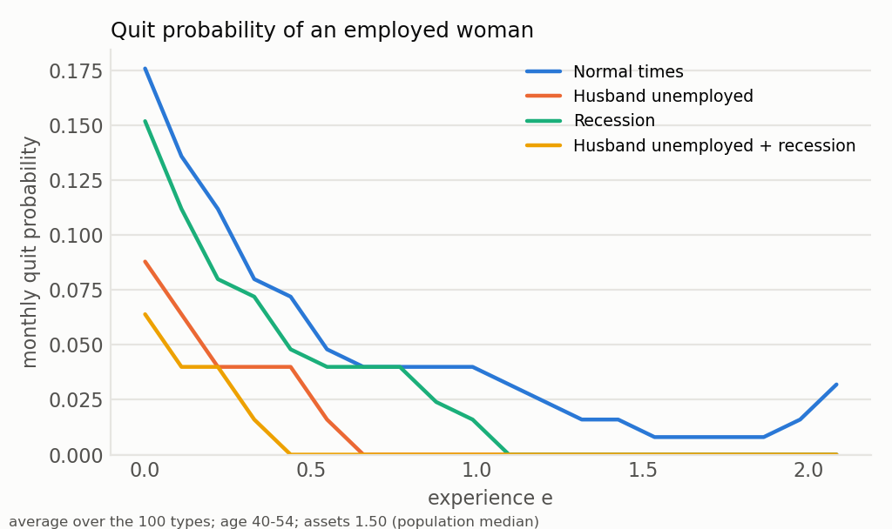
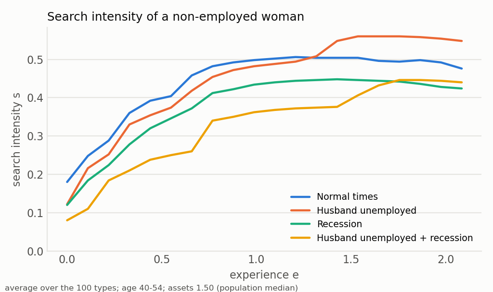
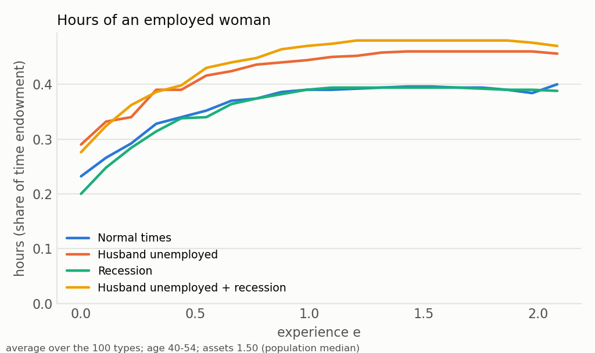
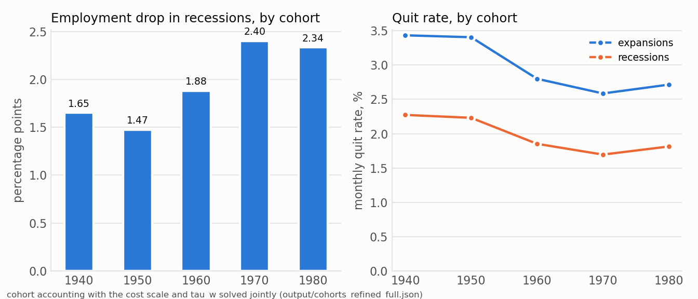
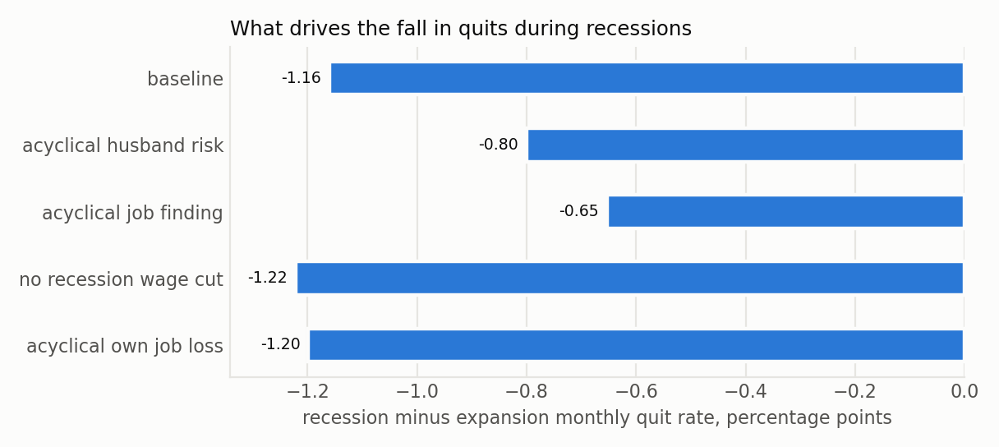
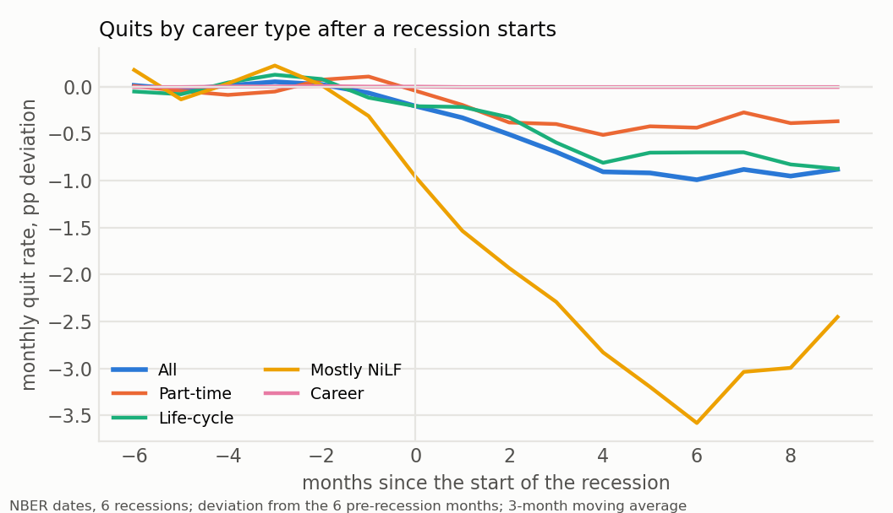

# Final model results: 1940s cohort calibration, trend experiments, mechanism

All numbers are produced by scripts in `Code26/python/scripts`; the files cited are in `Code26/python/output`. Model specification: `FINAL_MODEL.md`.

## 1. Calibration of the 1940s cohort

Source: `output/final_calib_v4c_full.json` (objective 0.171, 54 evaluations, 100 types).

Least-squares polish (`scripts/calibrate_ls.py`, scipy trust-region reflective with bounds, finite-difference Jacobian on a common simulation seed) started from `output/final_calib_v4_full.json` (objective 0.256 as recorded in that file; fixed fields {'ui_rec_mult': 0.5}); fixed fields here {'ui_rec_mult': 0.5}. The never-working and career shares are the targets given up; the identification section below shows they cannot be moved together with the employment rate.

| parameter | value |
|---|---|
| mu | 0.9235 |
| kbar_max | 0.0144 |
| km_max | 6.8581 |
| tau_w | 0.7393 |
| lam_f0 | 0.4317 |
| lam_u0 | 0.0182 |
| lam_u1 | 0.0213 |
| ybar_h | 0.0641 |
| sd_kT | 0.2775 |
| home_young_mult | 1.7836 |
| nu_h | 0.6925 |
| z_h | 0.4504 |
| alpha_h | 0.3172 |
| e_max | 2.0846 |
| kappa_h_power | 0.3498 |
| lam_f_ratio | 0.8000 |

| target | data | model | deviation |
|---|---|---|---|
| E/pop | 0.6200 | 0.6737 | +8.7% |
| hours|E | 0.4000 | 0.4077 | +1.9% |
| share Lifecycle | 0.3100 | 0.3085 | -0.5% |
| share PT | 0.2800 | 0.2590 | -7.5% |
| share Career | 0.1900 | 0.1673 | -12.0% |
| share NiLF | 0.2200 | 0.2652 | +20.5% |
| quit/m exp | 0.0340 | 0.0343 | +1.0% |
| quit/m rec | 0.0280 | 0.0227 | -18.8% |
| E->nonE/m exp | 0.0500 | 0.0530 | +5.9% |
| E->nonE/m rec | 0.0480 | 0.0440 | -8.3% |
| dE/pop rec-exp (pts) | -1.7000 | -1.6494 | +5.1% |
| wage gap (hourly ratio) | 0.7100 | 0.7308 | +2.9% |
| sd log UE (women) | 0.0686 | 0.0686 | -0.0% |

| untargeted moment | model |
|---|---|
| U rate | 0.0441 |
| wife share exp | 0.3316 |
| wife share rec | 0.3480 |
| HH income rec/exp - 1 (%) | -16.4267 |
| cons drop at H job loss exp (%) | -5.0742 |
| cons drop at H job loss rec (%) | -8.5594 |
| mean assets/monthly HH inc | 1.4538 |
| share e at cap | 0.2384 |

### 1a. Alternative calibrations side by side

* **adopted iid (ls)**: `output/final_calib_ls_full.json` (objective 0.449, 50 evaluations, calibrated on 100 types, moments re-evaluated on the 100-type grid; fixed fields {}).
* **version 3**: `output/final_calib_v3_full.json` (objective 0.759, 53 evaluations, calibrated on 100 types, moments re-evaluated on the 100-type grid; fixed fields {'ui_rec_mult': 0.5}).
* **version 4**: `output/final_calib_v4_full.json` (objective 0.256, 53 evaluations, calibrated on 100 types; fixed fields {'ui_rec_mult': 0.5}).
* **version 6 (persistent shock)**: `output/final_calib_v6_full.json` (objective 0.260, 74 evaluations, calibrated on 100 types; fixed fields {'ui_rec_mult': 0.5, 'n_kT': 3.0}).
* ** gamma 2)**: `output/final_calib_v7_full.json` (objective 0.311, 70 evaluations, calibrated on 100 types; fixed fields {'kpr': 1.0, 'gamma': 2.0, 'ui_rec_mult': 0.5}).
* **version 5b (log utility)**: `output/final_calib_v5b_full.json` (objective 0.306, 120 evaluations, calibrated on 100 types; fixed fields {'gamma': 1.0, 'ui_rec_mult': 0.5}).
* **recession UI cut**: `output/final_calib_ui_full.json` (objective 0.307, 50 evaluations, calibrated on 100 types, moments re-evaluated on the 100-type grid; fixed fields {'ui_rec_mult': 0.5}).
* **7 wage types**: `output/final_calib_om7_full.json` (objective 0.343, 50 evaluations, calibrated on 100 types, moments re-evaluated on the 100-type grid; fixed fields {'n_omega': 7.0}).

Fixed fields: `rho_kT` is the monthly probability that the cost-of-work shock keeps its value (0 in the iid model); `ui_rec_mult` multiplies the husband's unemployment income share in recessions; `n_omega` is the number of wage-type points. See `FINAL_MODEL.md`.

| parameter | adopted | adopted iid (ls) | version 3 | version 4 | version 6 (persistent shock) |  gamma 2) | version 5b (log utility) | recession UI cut | 7 wage types |
|---|---|---|---|---|---|---|---|---|---|
| mu | 0.9235 | 0.9289 | 0.9256 | 0.9125 | 1.0191 | 1.6567 | 1.4454 | 0.9325 | 0.9139 |
| kbar_max | 0.0144 | 0.0161 | 0.0143 | 0.0168 | 0.0243 | 0.0353 | 0.0429 | 0.0159 | 0.0152 |
| km_max | 6.8581 | 6.1120 | 6.0912 | 6.0882 | 6.6335 | 8.6762 | 6.8277 | 6.1052 | 6.1258 |
| tau_w | 0.7393 | 0.7493 | 0.7461 | 0.7483 | 0.7700 | 0.9040 | 0.8325 | 0.7482 | 0.7503 |
| lam_f0 | 0.4317 | 0.4011 | 0.3994 | 0.3975 | 0.4941 | 0.3826 | 0.3461 | 0.4005 | 0.4085 |
| lam_u0 | 0.0182 | 0.0169 | 0.0166 | 0.0166 | 0.0179 | 0.0198 | 0.0199 | 0.0168 | 0.0169 |
| lam_u1 | 0.0213 | 0.0200 | 0.0226 | 0.0223 | 0.0234 | 0.0209 | 0.0196 | 0.0212 | 0.0204 |
| ybar_h | 0.0641 | 0.0583 | 0.0633 | 0.0626 | 0.0531 | 0.0693 | 0.0661 | 0.0639 | 0.0639 |
| sd_kT | 0.2775 | 0.2919 | 0.2927 | 0.2905 | 0.2440 | 0.2720 | 0.4191 | 0.2936 | 0.2905 |
| home_young_mult | 1.7836 | 1.8226 | 1.8156 | 1.8156 | 1.8361 | 2.3547 | 2.2227 | 1.8208 | 1.8260 |
| nu_h | 0.6925 | 0.6875 | 0.6878 | 0.6857 | 0.7185 | 0.6777 | 0.6006 | 0.6878 | 0.6877 |
| z_h | 0.4504 | 0.4528 | 0.4532 | 0.4524 | 0.4321 | 0.5061 | 0.5102 | 0.4535 | 0.4529 |
| alpha_h | 0.3172 | 0.2492 | 0.2568 | 0.2636 | 0.3031 | 0.0513 | 0.3601 | 0.2578 | 0.2672 |
| e_max | 2.0846 | 1.9665 | 1.9698 | 2.0519 | 2.1902 | 2.3920 | 2.2011 | 1.9668 | 1.9635 |
| kappa_h_power | 0.3498 | 0.2873 | 0.2882 | 0.2875 | 0.2839 | 0.4634 | 0.3906 | 0.2875 | 0.2875 |
| lam_f_ratio | 0.8000 | - | 0.9000 | 0.8500 | 0.8000 | 0.8000 | 0.8000 | - | - |
| rho_kT | - | - | - | - | 0.3307 | - | - | - | - |

| target | data | adopted | adopted iid (ls) | version 3 | version 4 | version 6 (persistent shock) |  gamma 2) | version 5b (log utility) | recession UI cut | 7 wage types |
|---|---|---|---|---|---|---|---|---|---|---|
| E/pop | 0.6200 | 0.6737 (+9%) | 0.6641 (+7%) | 0.6668 (+8%) | 0.6658 (+7%) | 0.6593 (+6%) | 0.6299 (+2%) | 0.6187 (-0%) | 0.6589 (+6%) | 0.6697 (+8%) |
| hours|E | 0.4000 | 0.4077 (+2%) | 0.4097 (+2%) | 0.4085 (+2%) | 0.4145 (+4%) | 0.4096 (+2%) | 0.4295 (+7%) | 0.4404 (+10%) | 0.4066 (+2%) | 0.4112 (+3%) |
| share Lifecycle | 0.3100 | 0.3085 (-0%) | 0.3085 (-0%) | 0.2969 (-4%) | 0.3162 (+2%) | 0.3571 (+15%) | 0.2977 (-4%) | 0.3123 (+1%) | 0.3031 (-2%) | 0.3100 (+0%) |
| share PT | 0.2800 | 0.2590 (-8%) | 0.2502 (-11%) | 0.2587 (-8%) | 0.2419 (-14%) | 0.2275 (-19%) | 0.2746 (-2%) | 0.2408 (-14%) | 0.2612 (-7%) | 0.2594 (-7%) |
| share Career | 0.1900 | 0.1673 (-12%) | 0.1719 (-10%) | 0.1756 (-8%) | 0.1802 (-5%) | 0.1465 (-23%) | 0.1590 (-16%) | 0.1654 (-13%) | 0.1600 (-16%) | 0.1654 (-13%) |
| share NiLF | 0.2200 | 0.2652 (+21%) | 0.2694 (+22%) | 0.2687 (+22%) | 0.2617 (+19%) | 0.2690 (+22%) | 0.2687 (+22%) | 0.2815 (+28%) | 0.2756 (+25%) | 0.2652 (+21%) |
| quit/m exp | 0.0340 | 0.0343 (+1%) | 0.0332 (-2%) | 0.0329 (-3%) | 0.0322 (-5%) | 0.0350 (+3%) | 0.0315 (-7%) | 0.0316 (-7%) | 0.0341 (+0%) | 0.0330 (-3%) |
| quit/m rec | 0.0280 | 0.0227 (-19%) | 0.0250 (-11%) | 0.0248 (-11%) | 0.0229 (-18%) | 0.0239 (-15%) | 0.0236 (-16%) | 0.0231 (-18%) | 0.0245 (-12%) | 0.0243 (-13%) |
| E->nonE/m exp | 0.0500 | 0.0530 (+6%) | 0.0505 (+1%) | 0.0499 (-0%) | 0.0492 (-2%) | 0.0535 (+7%) | 0.0515 (+3%) | 0.0517 (+3%) | 0.0512 (+2%) | 0.0504 (+1%) |
| E->nonE/m rec | 0.0480 | 0.0440 (-8%) | 0.0447 (-7%) | 0.0470 (-2%) | 0.0449 (-6%) | 0.0470 (-2%) | 0.0447 (-7%) | 0.0429 (-11%) | 0.0456 (-5%) | 0.0443 (-8%) |
| dE/pop rec-exp (pts) | -1.7000 | -1.6494 (+5%) | -1.6887 (+1%) | -1.6981 (+0%) | -1.8815 (-18%) | -1.6130 (+9%) | -1.7056 (-1%) | -1.7851 (-9%) | -1.7242 (-2%) | -1.6475 (+5%) |
| wage gap (hourly ratio) | 0.7100 | 0.7308 (+3%) | 0.7382 (+4%) | 0.7363 (+4%) | 0.7427 (+5%) | 0.7643 (+8%) | 0.9048 (+27%) | 0.8239 (+16%) | 0.7352 (+4%) | 0.7415 (+4%) |
| sd log UE (women) | 0.0686 | 0.0686 (-0%) | 0.0408 (-41%) | 0.0296 (-57%) | 0.0562 (-18%) | 0.0724 (+5%) | 0.0657 (-4%) | 0.0767 (+12%) | 0.0490 (-29%) | 0.0465 (-32%) |

| untargeted moment | adopted | adopted iid (ls) | version 3 | version 4 | version 6 (persistent shock) |  gamma 2) | version 5b (log utility) | recession UI cut | 7 wage types |
|---|---|---|---|---|---|---|---|---|---|
| U rate | 0.0441 | 0.0447 | 0.0447 | 0.0457 | 0.0396 | 0.0503 | 0.0606 | 0.0445 | 0.0434 |
| wife share exp | 0.3316 | 0.3319 | 0.3316 | 0.3360 | 0.3346 | 0.3864 | 0.3611 | 0.3270 | 0.3354 |
| cons drop at H job loss exp (%) | -5.0742 | -5.0741 | -5.0814 | -5.0523 | -5.0143 | -4.9191 | -5.3658 | -5.0871 | -5.0683 |
| cons drop at H job loss rec (%) | -8.5594 | -7.2569 | -8.5421 | -8.5003 | -8.4531 | -8.2230 | -8.5648 | -8.5456 | -7.3114 |
| mean assets/monthly HH inc | 1.4538 | 1.4074 | 1.4182 | 1.4797 | 1.4976 | 1.4479 | 0.5596 | 1.4181 | 1.4372 |

### 1b. Identification: local elasticities of the targeted moments

Source: `output/jacobian_final.json` (`scripts/jacobian_final.py`; one-sided +5% steps on the 100-type grid, common simulation seed). Entries are the percent change of the moment per percent change of the parameter; for the recession employment drop, percentage points per percent. Entries of at least 0.5 in absolute value are in bold.

| parameter | E/pop | hours | LC | PT | Career | NiLF | quit exp | quit rec | E->N exp | E->N rec | dE (pts) | wage gap |
|---|---|---|---|---|---|---|---|---|---|---|---|---|
| mu | -0.22 | -0.47 | **-1.95** | **+3.95** | **-3.59** | **+0.96** | **+0.80** | **+0.80** | **+0.52** | +0.45 | +0.00 | -0.06 |
| kbar_max | -0.09 | -0.01 | +0.37 | -0.26 | **-0.68** | +0.30 | +0.28 | +0.24 | +0.18 | +0.13 | +0.02 | -0.02 |
| km_max | -0.04 | +0.00 | +0.27 | +0.03 | **-0.57** | +0.05 | +0.10 | +0.09 | +0.06 | +0.05 | +0.01 | -0.03 |
| tau_w | **+0.94** | **+0.64** | +0.30 | **-0.69** | **+4.75** | **-3.03** | **-2.98** | **-3.44** | **-1.92** | **-1.90** | +0.04 | **+1.11** |
| lam_f0 | +0.03 | -0.05 | **+1.59** | **-2.78** | -0.18 | **+0.98** | **+1.85** | **+1.57** | **+1.17** | **+0.85** | -0.01 | -0.01 |
| lam_u0 | -0.09 | +0.00 | -0.32 | +0.46 | -0.48 | +0.26 | +0.15 | +0.05 | +0.43 | +0.05 | +0.04 | -0.01 |
| lam_u1 | -0.03 | +0.00 | -0.03 | +0.10 | -0.16 | +0.05 | +0.03 | +0.12 | +0.02 | **+0.52** | -0.05 | +0.00 |
| ybar_h | -0.13 | -0.07 | -0.07 | +0.00 | **-0.59** | +0.50 | +0.37 | +0.47 | +0.24 | +0.27 | +0.00 | -0.01 |
| sd_kT | -0.23 | -0.02 | **+1.21** | **-2.34** | **-0.73** | **+1.38** | **+1.69** | **+1.60** | **+1.08** | **+0.88** | -0.01 | +0.01 |
| home_young_mult | -0.24 | -0.13 | **+2.51** | -0.23 | **-4.05** | +0.14 | **+0.88** | **+0.96** | **+0.57** | **+0.52** | +0.03 | -0.24 |
| nu_h | -0.42 | -0.13 | -0.40 | +0.33 | **-1.55** | **+1.23** | +0.49 | **+1.05** | +0.33 | **+0.58** | -0.00 | +0.01 |
| z_h | **-0.79** | -0.49 | **-0.66** | **+1.09** | **-4.75** | **+3.06** | **+2.58** | **+3.22** | **+1.66** | **+1.75** | -0.03 | -0.11 |
| alpha_h | +0.04 | -0.00 | +0.11 | +0.23 | -0.27 | -0.16 | -0.09 | -0.19 | -0.06 | -0.11 | +0.01 | -0.02 |
| e_max | +0.06 | +0.16 | -0.04 | -0.46 | **+0.82** | -0.08 | -0.19 | -0.18 | -0.13 | -0.10 | +0.00 | +0.22 |
| kappa_h_power | +0.01 | -0.02 | -0.03 | +0.08 | -0.07 | +0.00 | +0.02 | +0.02 | +0.02 | +0.01 | +0.00 | -0.01 |
| lam_f_ratio | +0.02 | -0.01 | +0.21 | -0.36 | +0.00 | +0.11 | +0.12 | **+0.71** | +0.08 | +0.38 | +0.08 | -0.00 |

The never-working share is the lowest wage-type cell of the five-point grid (20% of women, mean 140-180 hours a year, all classified as never working) plus the part of the second cell (mean 450-680 hours) that averages under 400 hours; simulation-seed noise in the four career shares is under 1 point (`output/diag_careers.json`, `scripts/diag_careers.py`).

## 2. Single-factor experiments sized to the 1970s employment rate

Source: `output/final_results_v4c.json`. Scales: returns to experience x1.305, compensated wage gap x1.066 (husband income scaled to keep household income constant at baseline behaviour), cost of work x0.114.

| moment | baseline | RoE x1.30 | comp. wage gap x1.07 | cost x0.11 |
|---|---|---|---|---|
| E/pop | 0.6737 | 0.7285 | 0.7281 | 0.7286 |
| hours|E | 0.4077 | 0.4337 | 0.4317 | 0.4171 |
| U rate | 0.0441 | 0.0460 | 0.0451 | 0.0440 |
| quit/m exp | 0.0343 | 0.0248 | 0.0245 | 0.0255 |
| quit/m rec | 0.0227 | 0.0166 | 0.0161 | 0.0163 |
| E->nonE/m exp | 0.0530 | 0.0435 | 0.0432 | 0.0442 |
| E->nonE/m rec | 0.0440 | 0.0379 | 0.0373 | 0.0376 |
| dE/pop rec-exp (pts) | -1.6494 | -1.9483 | -1.6911 | -2.0839 |
| wife share exp | 0.3316 | 0.3935 | 0.3843 | 0.3632 |
| wife share rec | 0.3480 | 0.4115 | 0.4011 | 0.3786 |
| wage gap (hourly ratio) | 0.7308 | 0.8347 | 0.8129 | 0.7556 |
| share Lifecycle | 0.3085 | 0.2906 | 0.3254 | 0.1756 |
| share PT | 0.2590 | 0.2125 | 0.2329 | 0.3173 |
| share Career | 0.1673 | 0.2996 | 0.2585 | 0.2852 |
| share NiLF | 0.2652 | 0.1973 | 0.1831 | 0.2219 |
| HH income rec/exp - 1 (%) | -16.4267 | -16.0034 | -16.1825 | -16.5817 |
| cons drop at H job loss exp (%) | -5.0742 | -4.5314 | -4.6033 | -4.9469 |
| cons drop at H job loss rec (%) | -8.5594 | -8.0419 | -8.0519 | -8.4776 |
| mean assets/monthly HH inc | 1.4538 | 1.7282 | 1.5720 | 1.4570 |

Change in the cyclical quit gap (recession minus expansion monthly quit rate, percentage points) and in the recession employment drop relative to the baseline:

| experiment | quit gap | ΔE/pop rec-exp (pts) | E/pop |
|---|---|---|---|
| baseline | -1.161 | -1.649 | 0.674 |
| RoE x1.30 | -0.821 | -1.948 | 0.729 |
| comp. wage gap x1.07 | -0.842 | -1.691 | 0.728 |
| cost x0.11 | -0.926 | -2.084 | 0.729 |

Supplementary experiments (`output/extra_experiments_v4c.json`): child-care cost scaled toward zero (x0.53 of the excess home productivity at 25-39) and all cost components scaled jointly (x0.14).

| moment | baseline | child-care cost x0.53 | all costs x0.14 |
|---|---|---|---|
| E/pop | 0.6737 | 0.7308 | 0.7318 |
| hours|E | 0.4077 | 0.4231 | 0.4173 |
| U rate | 0.0441 | 0.0469 | 0.0440 |
| quit/m exp | 0.0343 | 0.0245 | 0.0251 |
| quit/m rec | 0.0227 | 0.0163 | 0.0159 |
| E->nonE/m exp | 0.0530 | 0.0431 | 0.0437 |
| E->nonE/m rec | 0.0440 | 0.0374 | 0.0373 |
| dE/pop rec-exp (pts) | -1.6494 | -2.3719 | -2.1336 |
| wife share exp | 0.3316 | 0.3723 | 0.3649 |
| wife share rec | 0.3480 | 0.3884 | 0.3803 |
| wage gap (hourly ratio) | 0.7308 | 0.7681 | 0.7573 |
| share Lifecycle | 0.3085 | 0.1129 | 0.1598 |
| share PT | 0.2590 | 0.2338 | 0.3285 |
| share Career | 0.1673 | 0.4163 | 0.2908 |
| share NiLF | 0.2652 | 0.2371 | 0.2208 |
| HH income rec/exp - 1 (%) | -16.4267 | -16.7086 | -16.5929 |
| cons drop at H job loss exp (%) | -5.0742 | -4.6713 | -4.9338 |
| cons drop at H job loss rec (%) | -8.5594 | -8.3385 | -8.4660 |
| mean assets/monthly HH inc | 1.4538 | 1.4720 | 1.4572 |

| experiment | quit gap | ΔE/pop rec-exp (pts) | E/pop |
|---|---|---|---|
| child-care cost x0.53 | -0.820 | -2.372 | 0.731 |
| all costs x0.14 | -0.913 | -2.134 | 0.732 |

## 3. Cohort accounting

τ_w and γ_e follow the slides (p.35) relative to 1940 (wage gap 0.71, 0.74, 0.77, 0.76, 0.77; γ_e 0.50, 0.55, 0.58, 0.68, 0.69), with the husband's income compensated; the cost of work is scaled to reproduce each cohort's employment rate (0.62, 0.67, 0.71, 0.73, 0.72).

| moment | 1940 | 1950 (cost x2.00) | 1960 (cost x2.00) | 1970 (cost x2.00) | 1980 (cost x2.00) |
|---|---|---|---|---|---|
| E/pop | 0.6737 | 0.6761 | 0.7168 | 0.7384 | 0.7535 |
| hours|E | 0.4077 | 0.4288 | 0.4468 | 0.4564 | 0.4613 |
| U rate | 0.0441 | 0.0458 | 0.0468 | 0.0477 | 0.0482 |
| quit/m exp | 0.0343 | 0.0313 | 0.0240 | 0.0209 | 0.0187 |
| quit/m rec | 0.0227 | 0.0199 | 0.0155 | 0.0135 | 0.0118 |
| E->nonE/m exp | 0.0530 | 0.0499 | 0.0426 | 0.0395 | 0.0374 |
| E->nonE/m rec | 0.0440 | 0.0411 | 0.0368 | 0.0348 | 0.0331 |
| dE/pop rec-exp (pts) | -1.6494 | -1.4102 | -1.5829 | -1.5962 | -1.3096 |
| wife share exp | 0.3316 | 0.3617 | 0.4050 | 0.4315 | 0.4449 |
| wife share rec | 0.3480 | 0.3789 | 0.4227 | 0.4497 | 0.4641 |
| wage gap (hourly ratio) | 0.7308 | 0.8015 | 0.8773 | 0.9311 | 0.9578 |
| share Lifecycle | 0.3085 | 0.3817 | 0.4046 | 0.3962 | 0.3987 |
| share PT | 0.2590 | 0.2031 | 0.1765 | 0.1469 | 0.1396 |
| share Career | 0.1673 | 0.1773 | 0.2477 | 0.3100 | 0.3387 |
| share NiLF | 0.2652 | 0.2379 | 0.1713 | 0.1469 | 0.1229 |
| HH income rec/exp - 1 (%) | -16.4267 | -16.0741 | -15.7866 | -15.5748 | -15.3319 |
| cons drop at H job loss exp (%) | -5.0742 | -4.7445 | -4.3074 | -4.0664 | -3.9144 |
| cons drop at H job loss rec (%) | -8.5594 | -8.1822 | -7.7482 | -7.4439 | -7.2858 |
| mean assets/monthly HH inc | 1.4538 | 1.6455 | 1.7289 | 1.8295 | 1.8280 |

### 3b. Cohort accounting, refined: cost scale and τ_w solved jointly

Source: `output/cohorts_refined_v4c.json`. For each cohort the cost scale and τ_w (husband's income compensated) are solved so that the cohort's employment rate and its measured within-couple wage gap (data ratio applied to the model's 1940 gap) both match, given the cohort's γ_e.

| | 1940 | 1950 | 1960 | 1970 | 1980 |
|---|---|---|---|---|---|
| cost scale | 1.000 | 1.433 | 0.935 | 0.104 | 0.396 |
| τ_w | 0.739 | 0.742 | 0.742 | 0.685 | 0.692 |
| E/pop | 0.6737 | 0.6700 | 0.7101 | 0.7300 | 0.7200 |
| wage gap (hourly ratio) | 0.7308 | 0.7617 | 0.7924 | 0.7823 | 0.7926 |
| quit/m exp | 0.0343 | 0.0341 | 0.0280 | 0.0259 | 0.0272 |
| quit/m rec | 0.0227 | 0.0223 | 0.0185 | 0.0170 | 0.0181 |
| dE/pop rec-exp (pts) | -1.6494 | -1.4739 | -1.8812 | -2.4014 | -2.3353 |
| wife share exp | 0.3316 | 0.3440 | 0.3716 | 0.3761 | 0.3768 |
| share Lifecycle | 0.3085 | 0.3444 | 0.3017 | 0.1688 | 0.2135 |
| share PT | 0.2590 | 0.2188 | 0.2256 | 0.2510 | 0.2269 |
| share Career | 0.1673 | 0.1733 | 0.2487 | 0.3440 | 0.3215 |
| share NiLF | 0.2652 | 0.2635 | 0.2240 | 0.2362 | 0.2381 |
| cons drop at H job loss rec (%) | -8.5594 | -8.4495 | -8.2753 | -8.4447 | -8.3652 |
| residual (|ΔE|+|Δgap|) | 0.0000 | 0.0000 | 0.0003 | 0.0001 | 0.0000 |

## 4. Mechanism counterfactuals (baseline parameters)

| counterfactual | quit exp | quit rec | quit gap (pts) | ΔE/pop rec-exp (pts) | E/pop |
|---|---|---|---|---|---|
| baseline | 0.0343 | 0.0227 | -1.161 | -1.649 | 0.674 |
| acyclical husband risk | 0.0351 | 0.0271 | -0.800 | -2.882 | 0.666 |
| acyclical job finding | 0.0352 | 0.0287 | -0.653 | +0.115 | 0.675 |
| no recession wage cut | 0.0337 | 0.0214 | -1.222 | -0.034 | 0.682 |
| acyclical own job loss | 0.0342 | 0.0222 | -1.199 | -0.667 | 0.677 |

Decomposition of the baseline quit gap (share removed when each channel is switched off):

| channel | quit gap without it | share of baseline gap |
|---|---|---|
| acyclical husband risk | -0.800 | +31% |
| acyclical job finding | -0.653 | +44% |
| no recession wage cut | -1.222 | -5% |
| acyclical own job loss | -1.199 | -3% |

### 4b. Precautionary labor supply versus job hoarding: what governs the split

Source: `scripts/channels.py`. Quit gap = recession minus expansion monthly quit rate (points). Precaution share = fall in the gap when the husband's risk (job loss, job finding, recession UI cut) is made acyclical; hoarding share = fall when the wife's job-finding efficiency is made acyclical; both off = fall when both are. Parameters are held at the calibrated values within each block; only the named ingredient changes.

**version 4c** (`output/channels_v4c.json`)

| variant | E/pop | quit exp | quit rec | gap | precaution | hoarding | both off | dE base | dE acyc. husband |
|---|---|---|---|---|---|---|---|---|---|
| baseline | 0.674 | 0.0343 | 0.0227 | -1.16 | 31% | 44% | 66% | -1.65 | -2.88 |
| job finding falls 5% in recessions (ratio 0.95) | 0.675 | 0.0350 | 0.0270 | -0.80 | 37% | 18% | 51% | -0.41 | -1.37 |
| job finding falls 30% in recessions (ratio 0.70) | 0.672 | 0.0341 | 0.0201 | -1.41 | 27% | 54% | 72% | -2.57 | -3.91 |
| husband job loss x2.5 in recessions (data: x1.78) | 0.678 | 0.0337 | 0.0208 | -1.29 | 38% | 37% | 70% | -1.17 | -2.88 |
| husband job finding 0.20 in recessions (data: 0.28) | 0.677 | 0.0339 | 0.0209 | -1.30 | 38% | 36% | 70% | -1.22 | -2.88 |
| UI replacement 15% in recessions (ui_rec_mult 0.5) | 0.674 | 0.0343 | 0.0227 | -1.16 | 31% | 44% | 66% | -1.65 | -2.88 |
| UI replacement 15% always | 0.687 | 0.0319 | 0.0209 | -1.09 | 26% | 43% | 63% | -1.42 | -2.69 |
| no assets | 0.678 | 0.0326 | 0.0203 | -1.24 | 37% | 39% | 68% | -1.47 | -3.29 |
| risk aversion 3 | 0.562 | 0.0803 | 0.0402 | -4.01 | 30% | 35% | 70% | +1.75 | -2.24 |
| longer recessions (persistence 0.95) | 0.675 | 0.0341 | 0.0214 | -1.26 | 25% | 41% | 61% | -2.53 | -3.96 |

**adopted iid (ls)** (`output/channels_ls.json`)

| variant | E/pop | quit exp | quit rec | gap | precaution | hoarding | both off | dE base | dE acyc. husband |
|---|---|---|---|---|---|---|---|---|---|
| baseline | 0.664 | 0.0332 | 0.0250 | -0.82 | 19% | 39% | 52% | -1.69 | -2.23 |
| job finding falls 5% in recessions (ratio 0.95) | 0.664 | 0.0337 | 0.0275 | -0.62 | 21% | 19% | 36% | -0.74 | -1.16 |
| job finding falls 30% in recessions (ratio 0.70) | 0.662 | 0.0327 | 0.0208 | -1.19 | 18% | 58% | 67% | -2.87 | -3.69 |
| husband job loss x2.5 in recessions (data: x1.78) | 0.668 | 0.0327 | 0.0232 | -0.95 | 30% | 39% | 59% | -1.24 | -2.23 |
| husband job finding 0.20 in recessions (data: 0.28) | 0.667 | 0.0327 | 0.0232 | -0.95 | 30% | 34% | 59% | -1.20 | -2.23 |
| UI replacement 15% in recessions (ui_rec_mult 0.5) | 0.668 | 0.0327 | 0.0227 | -1.00 | 33% | 36% | 61% | -1.11 | -2.23 |
| UI replacement 15% always | 0.679 | 0.0306 | 0.0218 | -0.88 | 23% | 34% | 57% | -1.09 | -1.98 |
| no assets | 0.667 | 0.0316 | 0.0230 | -0.86 | 24% | 42% | 55% | -1.82 | -2.50 |
| risk aversion 3 | 0.552 | 0.0755 | 0.0465 | -2.90 | 24% | 36% | 61% | +0.38 | -1.93 |
| longer recessions (persistence 0.95) | 0.664 | 0.0330 | 0.0239 | -0.91 | 14% | 38% | 46% | -2.76 | -3.25 |

**version 4** (`output/channels_v4.json`)

| variant | E/pop | quit exp | quit rec | gap | precaution | hoarding | both off | dE base | dE acyc. husband |
|---|---|---|---|---|---|---|---|---|---|
| baseline | 0.666 | 0.0322 | 0.0229 | -0.93 | 33% | 34% | 59% | -1.88 | -2.76 |

**version 6 (persistent shock)** (`output/channels_v6.json`)

| variant | E/pop | quit exp | quit rec | gap | precaution | hoarding | both off | dE base | dE acyc. husband |
|---|---|---|---|---|---|---|---|---|---|
| baseline | 0.659 | 0.0350 | 0.0239 | -1.11 | 29% | 48% | 71% | -1.61 | -2.93 |
| job finding falls 5% in recessions (ratio 0.95) | 0.661 | 0.0354 | 0.0284 | -0.70 | 37% | 17% | 54% | -0.28 | -1.46 |
| job finding falls 30% in recessions (ratio 0.70) | 0.658 | 0.0348 | 0.0209 | -1.39 | 24% | 58% | 77% | -2.71 | -4.17 |
| husband job loss x2.5 in recessions (data: x1.78) | 0.664 | 0.0345 | 0.0217 | -1.28 | 39% | 43% | 75% | -0.93 | -2.93 |
| husband job finding 0.20 in recessions (data: 0.28) | 0.664 | 0.0346 | 0.0223 | -1.23 | 36% | 40% | 74% | -1.10 | -2.93 |
| UI replacement 15% in recessions (ui_rec_mult 0.5) | 0.659 | 0.0350 | 0.0239 | -1.11 | 29% | 48% | 71% | -1.61 | -2.93 |
| UI replacement 15% always | 0.675 | 0.0324 | 0.0215 | -1.09 | 32% | 51% | 72% | -1.58 | -3.00 |
| no assets | 0.666 | 0.0331 | 0.0203 | -1.28 | 42% | 45% | 74% | -1.20 | -3.28 |
| risk aversion 3 | 0.533 | 0.0831 | 0.0422 | -4.08 | 38% | 35% | 70% | +3.34 | -1.77 |
| longer recessions (persistence 0.95) | 0.662 | 0.0347 | 0.0218 | -1.28 | 25% | 46% | 65% | -2.30 | -3.86 |

**version 7 (KPR gamma 2)** (`output/channels_v7.json`)

| variant | E/pop | quit exp | quit rec | gap | precaution | hoarding | both off | dE base | dE acyc. husband |
|---|---|---|---|---|---|---|---|---|---|
| baseline | 0.630 | 0.0315 | 0.0236 | -0.79 | 25% | 49% | 64% | -1.71 | -1.71 |

**version 5b (log utility)** (`output/channels_v5b.json`)

| variant | E/pop | quit exp | quit rec | gap | precaution | hoarding | both off | dE base | dE acyc. husband |
|---|---|---|---|---|---|---|---|---|---|
| baseline | 0.619 | 0.0316 | 0.0231 | -0.85 | 7% | 62% | 70% | -1.79 | -2.02 |
| job finding falls 5% in recessions (ratio 0.95) | 0.623 | 0.0322 | 0.0272 | -0.49 | 18% | 34% | 49% | +0.18 | -0.06 |
| job finding falls 30% in recessions (ratio 0.70) | 0.617 | 0.0312 | 0.0205 | -1.07 | 8% | 70% | 77% | -2.98 | -3.24 |
| husband job loss x2.5 in recessions (data: x1.78) | 0.619 | 0.0314 | 0.0226 | -0.88 | 11% | 57% | 72% | -1.74 | -2.02 |
| husband job finding 0.20 in recessions (data: 0.28) | 0.619 | 0.0315 | 0.0226 | -0.89 | 11% | 57% | 72% | -1.69 | -2.02 |
| UI replacement 15% in recessions (ui_rec_mult 0.5) | 0.619 | 0.0316 | 0.0231 | -0.85 | 7% | 62% | 70% | -1.79 | -2.02 |
| UI replacement 15% always | 0.624 | 0.0306 | 0.0221 | -0.85 | 9% | 62% | 72% | -1.74 | -2.00 |
| no assets | 0.617 | 0.0316 | 0.0229 | -0.87 | 9% | 62% | 69% | -1.65 | -1.98 |
| risk aversion 3 | 0.351 | 0.1873 | 0.1336 | -5.37 | 55% | 48% | 89% | -2.05 | -5.52 |
| longer recessions (persistence 0.95) | 0.616 | 0.0320 | 0.0221 | -0.99 | 5% | 56% | 62% | -2.83 | -3.03 |

**v5b + Epstein-Zin RRA 10** (`output/channels_v5b_rra10.json`)

| variant | E/pop | quit exp | quit rec | gap | precaution | hoarding | both off | dE base | dE acyc. husband |
|---|---|---|---|---|---|---|---|---|---|
| baseline | 0.575 | 0.0382 | 0.0299 | -0.83 | 9% | 68% | 79% | -2.20 | -2.49 |

**v5b + KPR gamma 2 imposed** (`output/channels_v5b_kpr2.json`)

| variant | E/pop | quit exp | quit rec | gap | precaution | hoarding | both off | dE base | dE acyc. husband |
|---|---|---|---|---|---|---|---|---|---|
| baseline | 0.565 | 0.0580 | 0.0415 | -1.65 | 22% | 50% | 73% | -1.70 | -2.71 |

**recession UI cut** (`output/channels_ui.json`)

| variant | E/pop | quit exp | quit rec | gap | precaution | hoarding | both off | dE base | dE acyc. husband |
|---|---|---|---|---|---|---|---|---|---|
| baseline | 0.659 | 0.0341 | 0.0245 | -0.95 | 29% | 34% | 58% | -1.72 | -2.61 |

### 4c. What moves the split: local sensitivity of the two shares

Source: `output/jacobian_channels_v4c.json` (`scripts/jacobian_channels.py`; +10% steps on `output/final_calib_v4c_full.json`, other parameters fixed). Baseline: precaution 31%, hoarding 44%, quit gap -1.16 points, sd log UE 0.0686, recession employment drop -1.65 (-2.88 without cyclical husband risk). Entries are changes per +1% of the named quantity: shares and the recession quit rate in percentage points, the quit gap and the employment drop in percentage points of the rate, sd log UE in units.

| quantity perturbed | precaution share | hoarding share | quit gap | sd log UE | dE | dE acyc. husband | quit rec |
|---|---|---|---|---|---|---|---|
| job-finding fall in recessions (1 - lam_f ratio) | -0.16 | +0.24 | -0.005 | +0.0006 | -0.016 | -0.025 | -0.006 |
| UI cut in recessions (1 - ui_rec_mult) | +0.13 | -0.10 | -0.002 | +0.0000 | +0.012 | +0.000 | -0.003 |
| husband job-loss rate in recessions | +0.22 | -0.16 | -0.004 | -0.0001 | +0.017 | +0.000 | -0.005 |
| husband job-finding rate in recessions | -0.17 | +0.19 | +0.003 | -0.0002 | -0.006 | +0.000 | +0.005 |
| husband job-loss rate (both states) | +0.08 | -0.20 | -0.001 | +0.0000 | +0.013 | -0.008 | -0.009 |
| UI replacement (both states) | +0.20 | +0.12 | -0.004 | -0.0002 | +0.005 | +0.000 | +0.003 |
| wife own job loss in recessions (lam_u1) | +0.12 | +0.01 | +0.000 | +0.0004 | -0.050 | -0.048 | +0.003 |
| job-finding efficiency level (lam_f0) | -0.20 | +0.27 | -0.025 | -0.0004 | +0.013 | -0.022 | +0.033 |
| cost-shock sd (sd_kT) | -0.21 | +0.37 | -0.021 | +0.0003 | -0.012 | -0.032 | +0.036 |
| recession wage cut (1 - phi_rec) | +0.07 | -0.17 | +0.000 | -0.0001 | -0.006 | -0.005 | +0.003 |
| asset limit a_max | -0.13 | +0.06 | -0.000 | -0.0001 | -0.001 | -0.001 | -0.002 |
| risk aversion gamma | +0.04 | +0.02 | -0.038 | +0.0007 | +0.055 | +0.004 | +0.029 |
| expected recession duration (1 / exit probability) | +0.19 | +0.14 | +0.002 | +0.0001 | -0.014 | -0.027 | +0.000 |

Ranking by the effect on precaution minus hoarding (percentage points per +1%), with what disciplines the quantity in the calibration:

| quantity | Δ(precaution − hoarding) per +1% | disciplined by |
|---|---|---|
| husband job-loss rate in recessions | +0.38 | external (CPS men's E→U cyclicality) |
| husband job-loss rate (both states) | +0.28 | external (CPS men's E→U rate) |
| recession wage cut (1 - phi_rec) | +0.24 | external (φ(rec) = 0.88) |
| UI cut in recessions (1 - ui_rec_mult) | +0.23 | assumed (ui_rec_mult 0.5, standing in for longer spells); not targeted |
| wife own job loss in recessions (lam_u1) | +0.11 | the recession E→nonE target (4.8%) |
| UI replacement (both states) | +0.08 | author decision (30%) |
| expected recession duration (1 / exit probability) | +0.05 | the aggregate chain (NBER frequencies) |
| risk aversion gamma | +0.03 | externally set (γ = 2); γ = 1 removes most of the precautionary share (section 6a) |
| asset limit a_max | -0.19 | grid choice; not targeted |
| husband job-finding rate in recessions | -0.36 | external (0.35 / 0.28; reproduces the men's sd log UE 0.0765) |
| job-finding fall in recessions (1 - lam_f ratio) | -0.40 | the women's UE-rate cyclicality target (sd log UE 0.0686) |
| job-finding efficiency level (lam_f0) | -0.48 | the employment-rate target (0.62) |
| cost-shock sd (sd_kT) | -0.58 | the monthly quit-rate targets (3.4% / 2.8%) |

*Precautionary labor supply versus job hoarding by calibration version (`scripts/figures_channels.py`).*

*Sensitivity of the two shares to the cyclical parameters (`scripts/jacobian_channels.py`).*

## 5. Robustness (calibrated parameters held fixed)

Source: `output/robustness_final_v4c.json`.

| variant | E/pop | quit gap | ΔE/pop rec-exp | acyclical husband risk: quit gap | RoE experiment: E/pop | RoE: quit gap |
|---|---|---|---|---|---|---|
| baseline | 0.674 | -1.161 | -1.649 | -0.884 | 0.729 | -0.821 |
| no assets (a_max 0.01, 5 points) | 0.678 | -1.238 | -1.470 | -0.942 | 0.733 | -0.879 |
| asset grid 40 points | 0.677 | -1.076 | -1.873 | -0.876 | 0.733 | -0.752 |
| asset grid 40 points, a_max 30 | 0.677 | -1.114 | -1.791 | -0.902 | 0.731 | -0.797 |
| hours grid 40 points | 0.674 | -1.158 | -1.649 | -0.894 | 0.729 | -0.813 |
| hours grid 40, h_min 0.025 | 0.673 | -1.179 | -1.666 | -0.905 | 0.726 | -0.830 |
| U threshold s_bar 0.10 | 0.674 | -1.161 | -1.649 | -0.884 | 0.729 | -0.821 |
| U threshold s_bar 0.50 | 0.674 | -1.161 | -1.649 | -0.884 | 0.729 | -0.821 |
| phi_rec_H = 1 (no recession cut in husband income) | 0.666 | -0.909 | -2.453 | -0.725 | 0.720 | -0.692 |

## 6. Summary of findings

* Calibration: employment 0.674 (target 0.62), hours 0.408 (0.40), monthly quit rate 0.0343 in expansions and 0.0227 in recessions (targets 0.034 / 0.028), recession employment drop -1.65 points (-1.7), wage gap 0.731 (0.71); career shares life-cycle 0.31, part-time 0.26, career 0.17, NiLF 0.27 (0.31 / 0.28 / 0.19 / 0.22). Untargeted: unemployment rate 0.044, wife's income share 0.332, consumption falls 5.1% at the husband's job loss in expansions and 8.6% in recessions.
* Quits are pro-cyclical: the monthly quit rate falls by 34% in recessions (-1.16 points). Decomposition: making the husband's job-loss risk acyclical removes +31% of the drop, making job finding acyclical removes +44%, removing the recession wage cut changes it by -5% (the wage cut works against the insurance motive), and making the wife's own job loss acyclical changes it by -3%.
* Recession employment drop -1.65 points in the baseline; -2.88 without cyclical husband risk (precautionary labor supply offsets -1.23 points), +0.12 without the fall in job finding, -0.03 without the wage cut, -0.67 without cyclical own job loss.
* Trend to cycle, each force sized to the 1970s employment rate: RoE x1.30: employment 0.729, recession drop -1.95 points (baseline -1.65), quit gap -0.82 (baseline -1.16), career shares LC/PT/career/NiLF 0.29/0.21/0.30/0.20; comp. wage gap x1.07: employment 0.728, recession drop -1.69 points (baseline -1.65), quit gap -0.84 (baseline -1.16), career shares LC/PT/career/NiLF 0.33/0.23/0.26/0.18; cost x0.11: employment 0.729, recession drop -2.08 points (baseline -1.65), quit gap -0.93 (baseline -1.16), career shares LC/PT/career/NiLF 0.18/0.32/0.29/0.22.
* Cohort accounting with the data's wage-gap and returns-to-experience paths (household income compensated): the residual cost scale is 1940: x1.00, 1950: x2.00, 1960: x2.00, 1970: x2.00, 1980: x2.00; the recession employment drop goes from -1.65 to -1.31 points and the expansion quit rate from 0.0343 to 0.0187. Caveat: tau_w is scaled by the raw data ratio, so the measured wage gap in the model rises to 0.96 by the last cohort (data 0.77); the next refinement is to solve tau_w per cohort to hit the measured gap jointly with the cost residual.
* Refined cohort accounting (cost scale and tau_w solved jointly, section 3b): cost scale 1940: x1.00, 1950: x1.43, 1960: x0.94, 1970: x0.10, 1980: x0.40; tau_w 0.739, 0.742, 0.742, 0.685, 0.692; the recession employment drop goes from -1.65 to -2.34 points (+42%), the expansion quit rate from 0.0343 to 0.0272, the life-cycle share from 0.31 to 0.21 and the career share from 0.17 to 0.32. This is the cohort result to use; the raw-ratio version above is superseded.

### 6a. All calibrated versions (`scripts/versions_table.py`, `output/versions_summary.json`)

Objective: weighted sum of squared deviations over the 13 targets of `keam/final/calibrate.py` (100-type moments). Target columns: relative deviation from the data, except dE dev (the recession employment drop, deviation in points). Precaution / hoarding: share of the recession fall in the monthly quit rate removed when the husband's risk / the wife's job-finding efficiency is made acyclical (`scripts/channels.py`). dE: recession minus expansion employment rate (points), baseline and with acyclical husband risk.

| version | objective | E/pop | hours | LC | PT | career | NiLF | quit exp | quit rec | exit exp | exit rec | dE dev (pts) | wage gap | sd log UE | λ_f rec/exp | quit gap | precaution | hoarding | both off | dE rec | dE acyc. husband |
|---|---|---|---|---|---|---|---|---|---|---|---|---|---|---|---|---|---|---|---|---|---|
| adopted iid | 0.449 | +7% | +2% | -0% | -11% | -10% | +22% | -2% | -11% | +1% | -7% | +0.01 | +4% | -41% | 0.85 | -0.82 | 19% | 39% | 52% | -1.69 | -2.23 |
| UI cut | 0.307 | +6% | +2% | -2% | -7% | -16% | +25% | +0% | -12% | +2% | -5% | -0.02 | +4% | -29% | 0.85 | -0.95 | 29% | 34% | 58% | -1.72 | -2.61 |
| 7 wage types | 0.343 | +8% | +3% | +0% | -7% | -13% | +21% | -3% | -13% | +1% | -8% | +0.05 | +4% | -32% | 0.85 | -0.87 | 21% | 38% | 54% | -1.65 | -2.26 |
| version 3 | 0.759 | +8% | +2% | -4% | -8% | -8% | +22% | -3% | -11% | -0% | -2% | +0.00 | +4% | -57% | 0.90 | -0.81 | 29% | 25% | 50% | -1.70 | -2.53 |
| version 4 | 0.256 | +7% | +4% | +2% | -14% | -5% | +19% | -5% | -18% | -2% | -6% | -0.18 | +5% | -18% | 0.85 | -0.93 | 33% | 34% | 59% | -1.88 | -2.76 |
| version 4c | 0.171 | +9% | +2% | -0% | -8% | -12% | +21% | +1% | -19% | +6% | -8% | +0.05 | +3% | -0% | 0.80 | -1.16 | 31% | 44% | 66% | -1.65 | -2.88 |
| version 5 (log utility) | 0.396 | -2% | +8% | -9% | -2% | -23% | +34% | -7% | -17% | +3% | -9% | -0.15 | +15% | +17% | 0.80 | -0.84 | 7% | 56% | 66% | -1.85 | -2.10 |
| version 5b (log utility; 2nd polish) | 0.306 | -0% | +10% | +1% | -14% | -13% | +28% | -7% | -18% | +3% | -11% | -0.09 | +16% | +12% | 0.80 | -0.85 | 7% | 62% | 70% | -1.79 | -2.02 |
| version 6 (persistent shock) | 0.260 | +6% | +2% | +15% | -19% | -23% | +22% | +3% | -15% | +7% | -2% | +0.09 | +8% | +5% | 0.80 | -1.11 | 29% | 48% | 71% | -1.61 | -2.93 |

* version 4c: objective 0.171; precaution 31% vs hoarding 44% (13 points apart, rule: within 10); largest cyclical-moment deviation 19% (quit/m rec).
* version 5b (log utility; 2nd polish): objective 0.306; precaution 7% vs hoarding 62% (54 points apart, rule: within 10); largest cyclical-moment deviation 18% (quit/m rec).
* Carried forward: **version 4c** (`v4c`): no candidate satisfies the 10-point rule; this is the one closest to parity (it also has the lowest objective).
* Log utility and the precautionary channel: at the version-4c parameters (γ = 2) precaution is 31% and hoarding 44%; imposing γ = 1 without recalibrating gives 9% / 55% (`output/channels_v4c_gamma1.json`; employment 0.79, because the calibrated cost levels are in γ = 2 utility units), and the recalibrated log-utility version gives 7% / 62%. The fall is a property of the preferences, not of the recalibration. Fit: objective 0.306 versus 0.171; the largest deviations of the log-utility version are share NiLF +28%, quit/m rec -18%, wage gap (hourly ratio) +16%, share PT -14%.

## 7. Figures (`Code26/python/output/figures_v4c`, from `scripts/figures.py`)

*Quit probability of an employed woman over experience, by husband state and aggregate state (representative type, ages 40-54).*

*Search intensity of a non-employed woman over experience, by state.*

*Hours of an employed woman over experience, by state.*

*Refined cohort accounting: recession employment drop and monthly quit rates by cohort.*

*Decomposition of the recession fall in quits across counterfactuals.*

*Employment by career type after a recession starts (NBER dates, deviation from the six pre-recession months, average over the 1973-2007 recessions; `scripts/irf_careers.py`).*

*Quits by career type after a recession starts (same construction).*

## 8. What is fragile

* The never-working (NiLF) share is the least well fitted target. Section 1b shows why: it is one wage-type cell of the five-point grid plus part of the next, and every parameter that lowers it also raises the employment rate or the quit rates, so the weighted objective settles for a 20-25% overshoot. A finer wage-type grid or a second dimension of permanent home-productivity heterogeneity is the natural next step; a persistent cost shock (section 1a) does not help.
* In the refined cohort accounting the residual cost of work reaches its lower bound for the 1970s cohort (scale near zero): that cohort's employment rate and wage gap are reproduced with almost no fixed cost of work, so its row is a corner solution and its recession drop is an upper bound.
* The experience cap e_max is calibrated; the wage gap among employed wives is largely the experience premium at the cap, so the returns-to-experience experiment interacts with it.
* The transitory cost shock (sd σ_κ) drives the monthly quit rate; its distribution is not disciplined by micro data beyond the quit and exit rates.
* Career shares are computed on annual hours over ages 25-54 from the model's 4,000-hour endowment; the data taxonomy uses reported annual hours.

* The recession fall in the quit rate is 34% in the model against 18% in the data (recession quit rate 0.0227, target 0.028): with the UE-rate cyclicality matched, quits driven by a one-month cost draw respond too strongly to re-entry prospects. If the excess response is hoarding, the hoarding share is overstated by the same margin.
* The precaution / hoarding split rests on γ = 2: it is 31% / 44% in version 4c, and log utility (balanced growth) cuts precaution to single digits (section 6a). Keeping balanced growth and precaution together needs non-separable King-Plosser-Rebelo preferences (`kpr=True` in `keam/final/solve.py`; version 7, calibrated separately).
