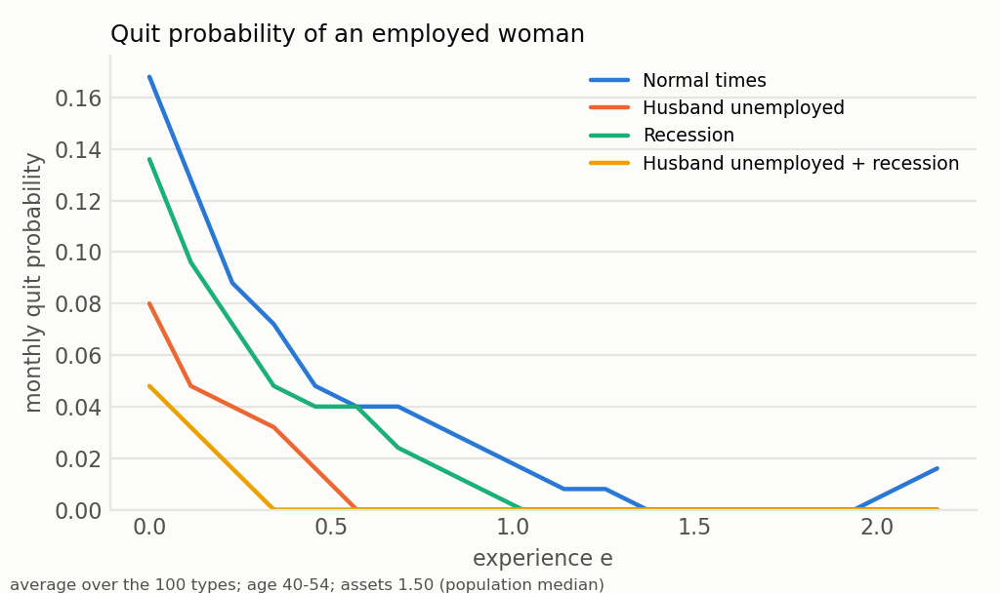
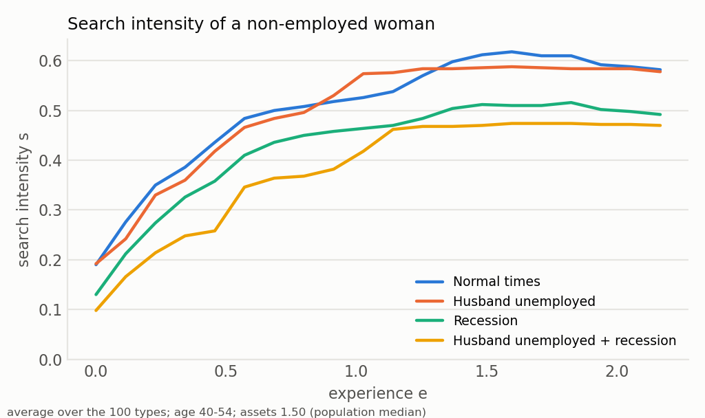
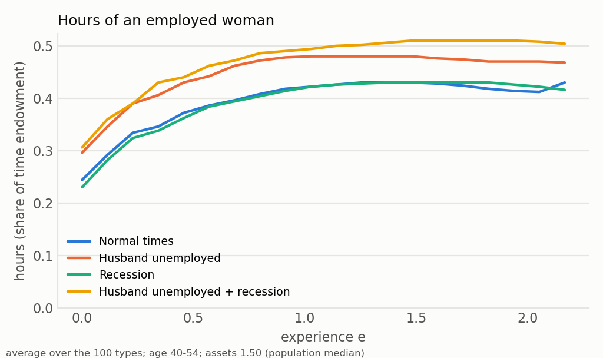
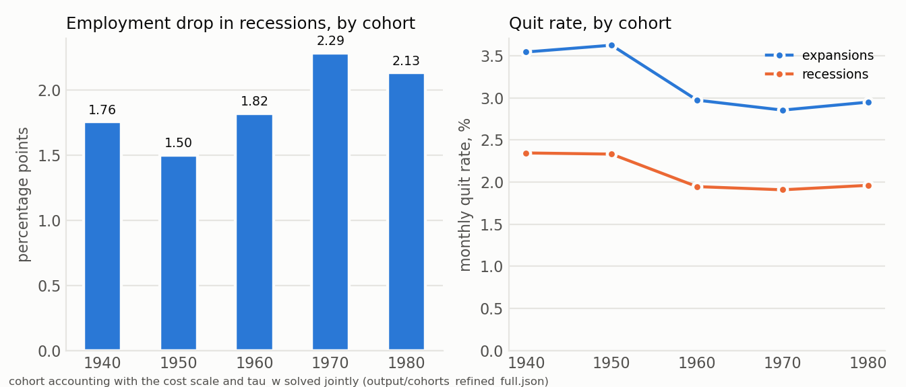
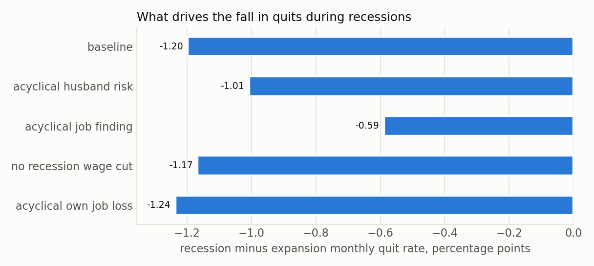
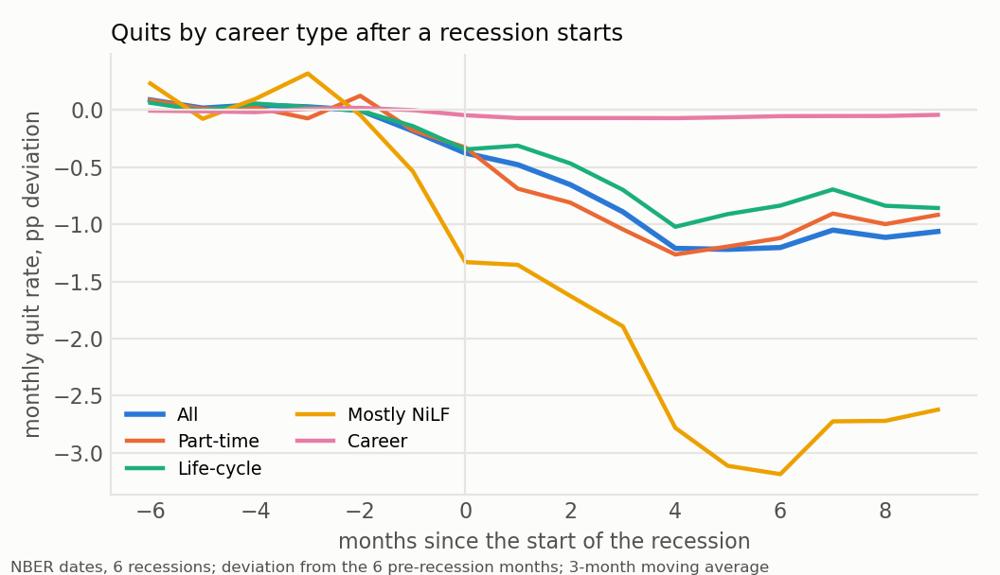

# Final model results: 1940s cohort calibration, trend experiments, mechanism

> **Simulator correction (2026-09-27).** Until commit `694af7f` the simulated husband never returned to
> employment (he stayed in the scarred state with 15% lower income and 2.5 times the job-loss rate; the
> solver used the correct transitions). Everything here is computed with the corrected simulator from
> version 4e (separable CRRA, γ = 2) unless labelled "pre-fix"; version 7c (King-Plosser-Rebelo
> preferences, growth-consistent) is the alternative calibration in sections 1a and 4b.

All numbers are produced by scripts in `Code26/python/scripts`; the files cited are in `Code26/python/output`. Model specification: `FINAL_MODEL.md`.

## 1. Calibration of the 1940s cohort

Source: `output/final_calib_v4e_full.json` (objective 0.139, 72 evaluations, 100 types).

Least-squares polish (`scripts/calibrate_ls.py`, scipy trust-region reflective with bounds, finite-difference Jacobian on a common simulation seed) started from `output/final_calib_v4c_full.json` (objective 0.171 as recorded in that file; fixed fields {'ui_rec_mult': 0.5}); fixed fields here {'ui_rec_mult': 0.5}. The never-working and career shares are the targets given up; the identification section below shows they cannot be moved together with the employment rate.

| parameter | value |
|---|---|
| mu | 0.8930 |
| kbar_max | 0.0226 |
| km_max | 6.8090 |
| tau_w | 0.7818 |
| lam_f0 | 0.4385 |
| lam_u0 | 0.0175 |
| lam_u1 | 0.0217 |
| ybar_h | 0.0547 |
| sd_kT | 0.2760 |
| home_young_mult | 1.7274 |
| nu_h | 0.6943 |
| z_h | 0.4472 |
| alpha_h | 0.3143 |
| e_max | 2.1668 |
| kappa_h_power | 0.3466 |
| lam_f_ratio | 0.8000 |

| target | data | model | deviation |
|---|---|---|---|
| E/pop | 0.6200 | 0.6831 | +10.2% |
| hours|E | 0.4000 | 0.4116 | +2.9% |
| share Lifecycle | 0.3100 | 0.3025 | -2.4% |
| share PT | 0.2800 | 0.2550 | -8.9% |
| share Career | 0.1900 | 0.1873 | -1.4% |
| share NiLF | 0.2200 | 0.2552 | +16.0% |
| quit/m exp | 0.0340 | 0.0354 | +4.2% |
| quit/m rec | 0.0280 | 0.0235 | -16.2% |
| E->nonE/m exp | 0.0500 | 0.0533 | +6.7% |
| E->nonE/m rec | 0.0480 | 0.0449 | -6.4% |
| dE/pop rec-exp (pts) | -1.7000 | -1.7584 | -5.8% |
| wage gap (hourly ratio) | 0.7100 | 0.7299 | +2.8% |
| sd log UE (women) | 0.0686 | 0.0705 | +2.8% |

| untargeted moment | model |
|---|---|
| U rate | 0.0456 |
| wife share exp | 0.3230 |
| wife share rec | 0.3330 |
| HH income rec/exp - 1 (%) | -15.2417 |
| cons drop at H job loss exp (%) | -6.7332 |
| cons drop at H job loss rec (%) | -10.0754 |
| mean assets/monthly HH inc | 1.8603 |
| share e at cap | 0.2511 |

### 1a. Alternative calibrations side by side

* **version 7c (KPR; corrected simulator)**: `output/final_calib_v7c_full.json` (objective 0.076, 104 evaluations, calibrated on 100 types, moments re-evaluated on the 100-type grid; fixed fields {'kpr': 1.0, 'gamma': 2.0, 'ui_rec_mult': 0.5}).
* **version 4c (pre-fix)**: `output/final_calib_v4c_full.json` (objective 0.803, 54 evaluations, calibrated on 100 types, moments re-evaluated on the 100-type grid; fixed fields {'ui_rec_mult': 0.5}).
* **version 7b KPR (pre-fix)**: `output/final_calib_v7b_full.json` (objective 0.424, 72 evaluations, calibrated on 100 types, moments re-evaluated on the 100-type grid; fixed fields {'kpr': 1.0, 'gamma': 2.0, 'ui_rec_mult': 0.5}).
* **version 6 persistent shock (pre-fix)**: `output/final_calib_v6_full.json` (objective 0.260, 74 evaluations, calibrated on 100 types; fixed fields {'ui_rec_mult': 0.5, 'n_kT': 3.0}).
* **version 5b log utility (pre-fix)**: `output/final_calib_v5b_full.json` (objective 0.306, 120 evaluations, calibrated on 100 types; fixed fields {'gamma': 1.0, 'ui_rec_mult': 0.5}).
* **adopted iid (pre-fix)**: `output/final_calib_ls_full.json` (objective 0.449, 50 evaluations, calibrated on 100 types, moments re-evaluated on the 100-type grid; fixed fields {}).

Fixed fields: `rho_kT` is the monthly probability that the cost-of-work shock keeps its value (0 in the iid model); `ui_rec_mult` multiplies the husband's unemployment income share in recessions; `n_omega` is the number of wage-type points. See `FINAL_MODEL.md`.

| parameter | adopted | version 7c (KPR; corrected simulator) | version 4c (pre-fix) | version 7b KPR (pre-fix) | version 6 persistent shock (pre-fix) | version 5b log utility (pre-fix) | adopted iid (pre-fix) |
|---|---|---|---|---|---|---|---|
| mu | 0.8930 | 1.3628 | 0.9235 | 1.4997 | 1.0191 | 1.4454 | 0.9289 |
| kbar_max | 0.0226 | 0.0202 | 0.0144 | 0.0194 | 0.0243 | 0.0429 | 0.0161 |
| km_max | 6.8090 | 6.9240 | 6.8581 | 8.3853 | 6.6335 | 6.8277 | 6.1120 |
| tau_w | 0.7818 | 0.7825 | 0.7393 | 0.7963 | 0.7700 | 0.8325 | 0.7493 |
| lam_f0 | 0.4385 | 0.4965 | 0.4317 | 0.4675 | 0.4941 | 0.3461 | 0.4011 |
| lam_u0 | 0.0175 | 0.0195 | 0.0182 | 0.0193 | 0.0179 | 0.0199 | 0.0169 |
| lam_u1 | 0.0217 | 0.0203 | 0.0213 | 0.0199 | 0.0234 | 0.0196 | 0.0200 |
| ybar_h | 0.0547 | 0.0496 | 0.0641 | 0.0706 | 0.0531 | 0.0661 | 0.0583 |
| sd_kT | 0.2760 | 0.1699 | 0.2775 | 0.2179 | 0.2440 | 0.4191 | 0.2919 |
| home_young_mult | 1.7274 | 2.4926 | 1.7836 | 2.3224 | 1.8361 | 2.2227 | 1.8226 |
| nu_h | 0.6943 | 0.6380 | 0.6925 | 0.6633 | 0.7185 | 0.6006 | 0.6875 |
| z_h | 0.4472 | 0.5220 | 0.4504 | 0.4950 | 0.4321 | 0.5102 | 0.4528 |
| alpha_h | 0.3143 | 0.0545 | 0.3172 | 0.1372 | 0.3031 | 0.3601 | 0.2492 |
| e_max | 2.1668 | 2.0643 | 2.0846 | 2.2874 | 2.1902 | 2.2011 | 1.9665 |
| kappa_h_power | 0.3466 | 0.4293 | 0.3498 | 0.3789 | 0.2839 | 0.3906 | 0.2873 |
| lam_f_ratio | 0.8000 | 0.8000 | 0.8000 | 0.8000 | 0.8000 | 0.8000 | - |
| rho_kT | - | - | - | - | 0.3307 | - | - |

| target | data | adopted | version 7c (KPR; corrected simulator) | version 4c (pre-fix) | version 7b KPR (pre-fix) | version 6 persistent shock (pre-fix) | version 5b log utility (pre-fix) | adopted iid (pre-fix) |
|---|---|---|---|---|---|---|---|---|
| E/pop | 0.6200 | 0.6831 (+10%) | 0.6763 (+9%) | 0.6451 (+4%) | 0.6503 (+5%) | 0.6593 (+6%) | 0.6187 (-0%) | 0.6641 (+7%) |
| hours|E | 0.4000 | 0.4116 (+3%) | 0.4134 (+3%) | 0.3825 (-4%) | 0.4050 (+1%) | 0.4096 (+2%) | 0.4404 (+10%) | 0.4097 (+2%) |
| share Lifecycle | 0.3100 | 0.3025 (-2%) | 0.3056 (-1%) | 0.2452 (-21%) | 0.2923 (-6%) | 0.3571 (+15%) | 0.3123 (+1%) | 0.3085 (-0%) |
| share PT | 0.2800 | 0.2550 (-9%) | 0.2727 (-3%) | 0.3310 (+18%) | 0.2542 (-9%) | 0.2275 (-19%) | 0.2408 (-14%) | 0.2502 (-11%) |
| share Career | 0.1900 | 0.1873 (-1%) | 0.1748 (-8%) | 0.1033 (-46%) | 0.1558 (-18%) | 0.1465 (-23%) | 0.1654 (-13%) | 0.1719 (-10%) |
| share NiLF | 0.2200 | 0.2552 (+16%) | 0.2469 (+12%) | 0.3204 (+46%) | 0.2977 (+35%) | 0.2690 (+22%) | 0.2815 (+28%) | 0.2694 (+22%) |
| quit/m exp | 0.0340 | 0.0354 (+4%) | 0.0333 (-2%) | 0.0429 (+26%) | 0.0396 (+16%) | 0.0350 (+3%) | 0.0316 (-7%) | 0.0332 (-2%) |
| quit/m rec | 0.0280 | 0.0235 (-16%) | 0.0253 (-10%) | 0.0293 (+4%) | 0.0298 (+6%) | 0.0239 (-15%) | 0.0231 (-18%) | 0.0250 (-11%) |
| E->nonE/m exp | 0.0500 | 0.0533 (+7%) | 0.0531 (+6%) | 0.0616 (+23%) | 0.0591 (+18%) | 0.0535 (+7%) | 0.0517 (+3%) | 0.0505 (+1%) |
| E->nonE/m rec | 0.0480 | 0.0449 (-6%) | 0.0457 (-5%) | 0.0505 (+5%) | 0.0496 (+3%) | 0.0470 (-2%) | 0.0429 (-11%) | 0.0447 (-7%) |
| dE/pop rec-exp (pts) | -1.7000 | -1.7584 (-6%) | -1.6658 (+3%) | -1.9548 (-25%) | -2.0457 (-35%) | -1.6130 (+9%) | -1.7851 (-9%) | -1.6887 (+1%) |
| wage gap (hourly ratio) | 0.7100 | 0.7299 (+3%) | 0.7118 (+0%) | 0.6781 (-4%) | 0.7369 (+4%) | 0.7643 (+8%) | 0.8239 (+16%) | 0.7382 (+4%) |
| sd log UE (women) | 0.0686 | 0.0705 (+3%) | 0.0682 (-1%) | 0.0634 (-8%) | 0.0767 (+12%) | 0.0724 (+5%) | 0.0767 (+12%) | 0.0408 (-41%) |

| untargeted moment | adopted | version 7c (KPR; corrected simulator) | version 4c (pre-fix) | version 7b KPR (pre-fix) | version 6 persistent shock (pre-fix) | version 5b log utility (pre-fix) | adopted iid (pre-fix) |
|---|---|---|---|---|---|---|---|
| U rate | 0.0456 | 0.0397 | 0.0451 | 0.0414 | 0.0396 | 0.0606 | 0.0447 |
| wife share exp | 0.3230 | 0.3273 | 0.2829 | 0.3229 | 0.3346 | 0.3611 | 0.3319 |
| cons drop at H job loss exp (%) | -6.7332 | -7.0656 | -7.1733 | -7.1105 | -5.0143 | -5.3658 | -5.0741 |
| cons drop at H job loss rec (%) | -10.0754 | -10.0996 | -10.5164 | -10.2573 | -8.4531 | -8.5648 | -7.2569 |
| mean assets/monthly HH inc | 1.8603 | 1.6206 | 1.7457 | 1.5920 | 1.4976 | 0.5596 | 1.4074 |

### 1b. Identification: local elasticities of the targeted moments

Source: `output/jacobian_final.json` (`scripts/jacobian_final.py`; one-sided +5% steps on the 100-type grid, common simulation seed). Entries are the percent change of the moment per percent change of the parameter; for the recession employment drop, percentage points per percent. Entries of at least 0.5 in absolute value are in bold.

| parameter | E/pop | hours | LC | PT | Career | NiLF | quit exp | quit rec | E->N exp | E->N rec | dE (pts) | wage gap |
|---|---|---|---|---|---|---|---|---|---|---|---|---|
| mu | -0.22 | -0.47 | **-1.95** | **+3.95** | **-3.59** | **+0.96** | **+0.80** | **+0.80** | **+0.52** | +0.45 | +0.00 | -0.06 |
| kbar_max | -0.09 | -0.01 | +0.37 | -0.26 | **-0.68** | +0.30 | +0.28 | +0.24 | +0.18 | +0.13 | +0.02 | -0.02 |
| km_max | -0.04 | +0.00 | +0.27 | +0.03 | **-0.57** | +0.05 | +0.10 | +0.09 | +0.06 | +0.05 | +0.01 | -0.03 |
| tau_w | **+0.94** | **+0.64** | +0.30 | **-0.69** | **+4.75** | **-3.03** | **-2.98** | **-3.44** | **-1.92** | **-1.90** | +0.04 | **+1.11** |
| lam_f0 | +0.03 | -0.05 | **+1.59** | **-2.78** | -0.18 | **+0.98** | **+1.85** | **+1.57** | **+1.17** | **+0.85** | -0.01 | -0.01 |
| lam_u0 | -0.09 | +0.00 | -0.32 | +0.46 | -0.48 | +0.26 | +0.15 | +0.05 | +0.43 | +0.05 | +0.04 | -0.01 |
| lam_u1 | -0.03 | +0.00 | -0.03 | +0.10 | -0.16 | +0.05 | +0.03 | +0.12 | +0.02 | **+0.52** | -0.05 | +0.00 |
| ybar_h | -0.13 | -0.07 | -0.07 | +0.00 | **-0.59** | +0.50 | +0.37 | +0.47 | +0.24 | +0.27 | +0.00 | -0.01 |
| sd_kT | -0.23 | -0.02 | **+1.21** | **-2.34** | **-0.73** | **+1.38** | **+1.69** | **+1.60** | **+1.08** | **+0.88** | -0.01 | +0.01 |
| home_young_mult | -0.24 | -0.13 | **+2.51** | -0.23 | **-4.05** | +0.14 | **+0.88** | **+0.96** | **+0.57** | **+0.52** | +0.03 | -0.24 |
| nu_h | -0.42 | -0.13 | -0.40 | +0.33 | **-1.55** | **+1.23** | +0.49 | **+1.05** | +0.33 | **+0.58** | -0.00 | +0.01 |
| z_h | **-0.79** | -0.49 | **-0.66** | **+1.09** | **-4.75** | **+3.06** | **+2.58** | **+3.22** | **+1.66** | **+1.75** | -0.03 | -0.11 |
| alpha_h | +0.04 | -0.00 | +0.11 | +0.23 | -0.27 | -0.16 | -0.09 | -0.19 | -0.06 | -0.11 | +0.01 | -0.02 |
| e_max | +0.06 | +0.16 | -0.04 | -0.46 | **+0.82** | -0.08 | -0.19 | -0.18 | -0.13 | -0.10 | +0.00 | +0.22 |
| kappa_h_power | +0.01 | -0.02 | -0.03 | +0.08 | -0.07 | +0.00 | +0.02 | +0.02 | +0.02 | +0.01 | +0.00 | -0.01 |
| lam_f_ratio | +0.02 | -0.01 | +0.21 | -0.36 | +0.00 | +0.11 | +0.12 | **+0.71** | +0.08 | +0.38 | +0.08 | -0.00 |

The never-working share is the lowest wage-type cell of the five-point grid (20% of women, mean 140-180 hours a year, all classified as never working) plus the part of the second cell (mean 450-680 hours) that averages under 400 hours; simulation-seed noise in the four career shares is under 1 point (`output/diag_careers.json`, `scripts/diag_careers.py`).

## 2. Single-factor experiments sized to the 1970s employment rate

Source: `output/final_results_v4e.json`. Scales: returns to experience x1.258, compensated wage gap x1.056 (husband income scaled to keep household income constant at baseline behaviour), cost of work x0.522.

| moment | baseline | RoE x1.26 | comp. wage gap x1.06 | cost x0.52 |
|---|---|---|---|---|
| E/pop | 0.6831 | 0.7316 | 0.7290 | 0.7298 |
| hours|E | 0.4116 | 0.4324 | 0.4302 | 0.4164 |
| U rate | 0.0456 | 0.0474 | 0.0472 | 0.0462 |
| quit/m exp | 0.0354 | 0.0266 | 0.0267 | 0.0286 |
| quit/m rec | 0.0235 | 0.0174 | 0.0170 | 0.0185 |
| E->nonE/m exp | 0.0533 | 0.0445 | 0.0446 | 0.0465 |
| E->nonE/m rec | 0.0449 | 0.0389 | 0.0385 | 0.0401 |
| dE/pop rec-exp (pts) | -1.7584 | -1.6706 | -1.5118 | -2.1811 |
| wife share exp | 0.3230 | 0.3735 | 0.3649 | 0.3453 |
| wife share rec | 0.3330 | 0.3860 | 0.3764 | 0.3549 |
| wage gap (hourly ratio) | 0.7299 | 0.8156 | 0.7965 | 0.7446 |
| share Lifecycle | 0.3025 | 0.2958 | 0.3090 | 0.2362 |
| share PT | 0.2550 | 0.2196 | 0.2477 | 0.2842 |
| share Career | 0.1873 | 0.2954 | 0.2610 | 0.2692 |
| share NiLF | 0.2552 | 0.1892 | 0.1823 | 0.2104 |
| HH income rec/exp - 1 (%) | -15.2417 | -14.7595 | -14.9728 | -15.3476 |
| cons drop at H job loss exp (%) | -6.7332 | -6.0931 | -6.1640 | -6.5250 |
| cons drop at H job loss rec (%) | -10.0754 | -9.5619 | -9.5565 | -9.9191 |
| mean assets/monthly HH inc | 1.8603 | 2.0015 | 1.9061 | 1.8925 |

Change in the cyclical quit gap (recession minus expansion monthly quit rate, percentage points) and in the recession employment drop relative to the baseline:

| experiment | quit gap | ΔE/pop rec-exp (pts) | E/pop |
|---|---|---|---|
| baseline | -1.198 | -1.758 | 0.683 |
| RoE x1.26 | -0.915 | -1.671 | 0.732 |
| comp. wage gap x1.06 | -0.966 | -1.512 | 0.729 |
| cost x0.52 | -1.007 | -2.181 | 0.730 |

Supplementary experiments (`output/extra_experiments_v4e.json`): child-care cost scaled toward zero (x0.56 of the excess home productivity at 25-39) and all cost components scaled jointly (x0.63).

| moment | baseline | child-care cost x0.56 | all costs x0.63 |
|---|---|---|---|
| E/pop | 0.6831 | 0.7318 | 0.7295 |
| hours|E | 0.4116 | 0.4245 | 0.4155 |
| U rate | 0.0456 | 0.0486 | 0.0458 |
| quit/m exp | 0.0354 | 0.0271 | 0.0287 |
| quit/m rec | 0.0235 | 0.0176 | 0.0187 |
| E->nonE/m exp | 0.0533 | 0.0449 | 0.0467 |
| E->nonE/m rec | 0.0449 | 0.0391 | 0.0402 |
| dE/pop rec-exp (pts) | -1.7584 | -2.3631 | -2.3265 |
| wife share exp | 0.3230 | 0.3553 | 0.3463 |
| wife share rec | 0.3330 | 0.3648 | 0.3562 |
| wage gap (hourly ratio) | 0.7299 | 0.7585 | 0.7489 |
| share Lifecycle | 0.3025 | 0.1483 | 0.2213 |
| share PT | 0.2550 | 0.2567 | 0.2767 |
| share Career | 0.1873 | 0.3721 | 0.2844 |
| share NiLF | 0.2552 | 0.2229 | 0.2177 |
| HH income rec/exp - 1 (%) | -15.2417 | -15.5335 | -15.3388 |
| cons drop at H job loss exp (%) | -6.7332 | -6.3294 | -6.5271 |
| cons drop at H job loss rec (%) | -10.0754 | -9.8114 | -9.9130 |
| mean assets/monthly HH inc | 1.8603 | 1.8891 | 1.8849 |

| experiment | quit gap | ΔE/pop rec-exp (pts) | E/pop |
|---|---|---|---|
| child-care cost x0.56 | -0.950 | -2.363 | 0.732 |
| all costs x0.63 | -0.997 | -2.327 | 0.730 |

## 3. Cohort accounting

τ_w and γ_e follow the slides (p.35) relative to 1940 (wage gap 0.71, 0.74, 0.77, 0.76, 0.77; γ_e 0.50, 0.55, 0.58, 0.68, 0.69), with the husband's income compensated; the cost of work is scaled to reproduce each cohort's employment rate (0.62, 0.67, 0.71, 0.73, 0.72).

| moment | 1940 | 1950 (cost x1.89) | 1960 (cost x1.94) | 1970 (cost x1.94) | 1980 (cost x2.00) |
|---|---|---|---|---|---|
| E/pop | 0.6831 | 0.6706 | 0.7099 | 0.7295 | 0.7378 |
| hours|E | 0.4116 | 0.4276 | 0.4462 | 0.4554 | 0.4604 |
| U rate | 0.0456 | 0.0472 | 0.0484 | 0.0489 | 0.0493 |
| quit/m exp | 0.0354 | 0.0334 | 0.0255 | 0.0225 | 0.0210 |
| quit/m rec | 0.0235 | 0.0212 | 0.0159 | 0.0141 | 0.0130 |
| E->nonE/m exp | 0.0533 | 0.0512 | 0.0434 | 0.0404 | 0.0389 |
| E->nonE/m rec | 0.0449 | 0.0427 | 0.0373 | 0.0356 | 0.0345 |
| dE/pop rec-exp (pts) | -1.7584 | -1.3050 | -1.2762 | -1.4206 | -1.3686 |
| wife share exp | 0.3230 | 0.3444 | 0.3860 | 0.4116 | 0.4233 |
| wife share rec | 0.3330 | 0.3563 | 0.3989 | 0.4246 | 0.4365 |
| wage gap (hourly ratio) | 0.7299 | 0.7986 | 0.8724 | 0.9253 | 0.9514 |
| share Lifecycle | 0.3025 | 0.3633 | 0.3942 | 0.3896 | 0.4006 |
| share PT | 0.2550 | 0.2006 | 0.1754 | 0.1544 | 0.1465 |
| share Career | 0.1873 | 0.1875 | 0.2487 | 0.3008 | 0.3154 |
| share NiLF | 0.2552 | 0.2485 | 0.1817 | 0.1552 | 0.1375 |
| HH income rec/exp - 1 (%) | -15.2417 | -14.8094 | -14.5648 | -14.4154 | -14.3034 |
| cons drop at H job loss exp (%) | -6.7332 | -6.3554 | -5.8543 | -5.5570 | -5.4238 |
| cons drop at H job loss rec (%) | -10.0754 | -9.7668 | -9.2468 | -8.9035 | -8.7645 |
| mean assets/monthly HH inc | 1.8603 | 1.9565 | 2.0092 | 2.1613 | 2.1723 |

### 3b. Cohort accounting, refined: cost scale and τ_w solved jointly

Source: `output/cohorts_refined_v4e.json`. For each cohort the cost scale and τ_w (husband's income compensated) are solved so that the cohort's employment rate and its measured within-couple wage gap (data ratio applied to the model's 1940 gap) both match, given the cohort's γ_e.

| | 1940 | 1950 | 1960 | 1970 | 1980 |
|---|---|---|---|---|---|
| cost scale | 1.000 | 1.466 | 1.142 | 0.666 | 0.876 |
| τ_w | 0.782 | 0.787 | 0.790 | 0.734 | 0.741 |
| E/pop | 0.6831 | 0.6700 | 0.7100 | 0.7300 | 0.7199 |
| wage gap (hourly ratio) | 0.7299 | 0.7607 | 0.7916 | 0.7813 | 0.7916 |
| quit/m exp | 0.0354 | 0.0362 | 0.0297 | 0.0285 | 0.0295 |
| quit/m rec | 0.0235 | 0.0233 | 0.0195 | 0.0191 | 0.0196 |
| dE/pop rec-exp (pts) | -1.7584 | -1.5016 | -1.8222 | -2.2880 | -2.1344 |
| wife share exp | 0.3230 | 0.3300 | 0.3566 | 0.3604 | 0.3612 |
| share Lifecycle | 0.3025 | 0.3350 | 0.3194 | 0.2369 | 0.2650 |
| share PT | 0.2550 | 0.2231 | 0.2181 | 0.2294 | 0.2196 |
| share Career | 0.1873 | 0.1806 | 0.2481 | 0.3152 | 0.2925 |
| share NiLF | 0.2552 | 0.2612 | 0.2144 | 0.2185 | 0.2229 |
| cons drop at H job loss rec (%) | -10.0754 | -9.9851 | -9.7368 | -9.8915 | -9.8056 |
| residual (|ΔE|+|Δgap|) | 0.0000 | 0.0000 | 0.0001 | 0.0000 | 0.0001 |

## 4. Mechanism counterfactuals (baseline parameters)

| counterfactual | quit exp | quit rec | quit gap (pts) | ΔE/pop rec-exp (pts) | E/pop |
|---|---|---|---|---|---|
| baseline | 0.0354 | 0.0235 | -1.198 | -1.758 | 0.683 |
| acyclical husband risk | 0.0372 | 0.0271 | -1.007 | -2.907 | 0.672 |
| acyclical job finding | 0.0363 | 0.0304 | -0.589 | +0.073 | 0.685 |
| no recession wage cut | 0.0350 | 0.0233 | -1.167 | -0.204 | 0.690 |
| acyclical own job loss | 0.0351 | 0.0227 | -1.236 | -0.589 | 0.688 |

Decomposition of the baseline quit gap (share removed when each channel is switched off):

| channel | quit gap without it | share of baseline gap |
|---|---|---|
| acyclical husband risk | -1.007 | +16% |
| acyclical job finding | -0.589 | +51% |
| no recession wage cut | -1.167 | +3% |
| acyclical own job loss | -1.236 | -3% |

### 4b. Precautionary labor supply versus job hoarding: what governs the split

Source: `scripts/channels.py`. Quit gap = recession minus expansion monthly quit rate (points). Precaution share = fall in the gap when the husband's risk (job loss, job finding, recession UI cut) is made acyclical; hoarding share = fall when the wife's job-finding efficiency is made acyclical; both off = fall when both are. Parameters are held at the calibrated values within each block; only the named ingredient changes.

**version 4e (separable; corrected simulator)** (`output/channels_v4e.json`)

| variant | E/pop | quit exp | quit rec | gap | precaution | hoarding | both off | dE base | dE acyc. husband |
|---|---|---|---|---|---|---|---|---|---|
| baseline | 0.683 | 0.0354 | 0.0235 | -1.20 | 16% | 51% | 71% | -1.76 | -2.91 |
| job finding falls 5% in recessions (ratio 0.95) | 0.684 | 0.0361 | 0.0285 | -0.75 | 34% | 22% | 55% | -0.30 | -0.97 |
| job finding falls 30% in recessions (ratio 0.70) | 0.681 | 0.0352 | 0.0202 | -1.49 | 13% | 61% | 77% | -2.74 | -3.79 |
| husband job loss x2.5 in recessions (data: x1.78) | 0.689 | 0.0344 | 0.0211 | -1.33 | 24% | 44% | 74% | -1.14 | -2.91 |
| husband job finding 0.20 in recessions (data: 0.28) | 0.687 | 0.0349 | 0.0220 | -1.29 | 22% | 46% | 74% | -1.24 | -2.91 |
| UI replacement 15% in recessions (ui_rec_mult 0.5) | 0.683 | 0.0354 | 0.0235 | -1.20 | 16% | 51% | 71% | -1.76 | -2.91 |
| UI replacement 15% always | 0.694 | 0.0334 | 0.0217 | -1.17 | 17% | 49% | 71% | -1.56 | -2.69 |
| no assets | 0.688 | 0.0336 | 0.0210 | -1.26 | 23% | 48% | 71% | -1.36 | -3.05 |
| risk aversion 3 | 0.526 | 0.1123 | 0.0585 | -5.37 | 15% | 30% | 58% | +1.53 | -1.15 |
| longer recessions (persistence 0.95) | 0.685 | 0.0351 | 0.0218 | -1.33 | 14% | 47% | 66% | -2.52 | -3.94 |

**version 7c (KPR; corrected simulator)** (`output/channels_v7c.json`)

| variant | E/pop | quit exp | quit rec | gap | precaution | hoarding | both off | dE base | dE acyc. husband |
|---|---|---|---|---|---|---|---|---|---|
| baseline | 0.676 | 0.0333 | 0.0253 | -0.80 | 16% | 47% | 62% | -1.67 | -1.62 |

**version 4c (pre-fix)** (`output/channels_v4c.json`)

| variant | E/pop | quit exp | quit rec | gap | precaution | hoarding | both off | dE base | dE acyc. husband |
|---|---|---|---|---|---|---|---|---|---|
| baseline | 0.674 | 0.0343 | 0.0227 | -1.16 | 31% | 44% | 66% | -1.65 | -2.88 |
| job finding falls 5% in recessions (ratio 0.95) | 0.675 | 0.0350 | 0.0270 | -0.80 | 37% | 18% | 51% | -0.41 | -1.37 |
| job finding falls 30% in recessions (ratio 0.70) | 0.672 | 0.0341 | 0.0201 | -1.41 | 27% | 54% | 72% | -2.57 | -3.91 |
| husband job loss x2.5 in recessions (data: x1.78) | 0.678 | 0.0337 | 0.0208 | -1.29 | 38% | 37% | 70% | -1.17 | -2.88 |
| husband job finding 0.20 in recessions (data: 0.28) | 0.677 | 0.0339 | 0.0209 | -1.30 | 38% | 36% | 70% | -1.22 | -2.88 |
| UI replacement 15% in recessions (ui_rec_mult 0.5) | 0.674 | 0.0343 | 0.0227 | -1.16 | 31% | 44% | 66% | -1.65 | -2.88 |
| UI replacement 15% always | 0.687 | 0.0319 | 0.0209 | -1.09 | 26% | 43% | 63% | -1.42 | -2.69 |
| no assets | 0.678 | 0.0326 | 0.0203 | -1.24 | 37% | 39% | 68% | -1.47 | -3.29 |
| risk aversion 3 | 0.562 | 0.0803 | 0.0402 | -4.01 | 30% | 35% | 70% | +1.75 | -2.24 |
| longer recessions (persistence 0.95) | 0.675 | 0.0341 | 0.0214 | -1.26 | 25% | 41% | 61% | -2.53 | -3.96 |

**version 7b KPR (pre-fix)** (`output/channels_v7b.json`)

| variant | E/pop | quit exp | quit rec | gap | precaution | hoarding | both off | dE base | dE acyc. husband |
|---|---|---|---|---|---|---|---|---|---|
| baseline | 0.661 | 0.0342 | 0.0254 | -0.88 | 28% | 47% | 64% | -1.69 | -1.84 |

**version 5b log utility (pre-fix)** (`output/channels_v5b.json`)

| variant | E/pop | quit exp | quit rec | gap | precaution | hoarding | both off | dE base | dE acyc. husband |
|---|---|---|---|---|---|---|---|---|---|
| baseline | 0.619 | 0.0316 | 0.0231 | -0.85 | 7% | 62% | 70% | -1.79 | -2.02 |
| job finding falls 5% in recessions (ratio 0.95) | 0.623 | 0.0322 | 0.0272 | -0.49 | 18% | 34% | 49% | +0.18 | -0.06 |
| job finding falls 30% in recessions (ratio 0.70) | 0.617 | 0.0312 | 0.0205 | -1.07 | 8% | 70% | 77% | -2.98 | -3.24 |
| husband job loss x2.5 in recessions (data: x1.78) | 0.619 | 0.0314 | 0.0226 | -0.88 | 11% | 57% | 72% | -1.74 | -2.02 |
| husband job finding 0.20 in recessions (data: 0.28) | 0.619 | 0.0315 | 0.0226 | -0.89 | 11% | 57% | 72% | -1.69 | -2.02 |
| UI replacement 15% in recessions (ui_rec_mult 0.5) | 0.619 | 0.0316 | 0.0231 | -0.85 | 7% | 62% | 70% | -1.79 | -2.02 |
| UI replacement 15% always | 0.624 | 0.0306 | 0.0221 | -0.85 | 9% | 62% | 72% | -1.74 | -2.00 |
| no assets | 0.617 | 0.0316 | 0.0229 | -0.87 | 9% | 62% | 69% | -1.65 | -1.98 |
| risk aversion 3 | 0.351 | 0.1873 | 0.1336 | -5.37 | 55% | 48% | 89% | -2.05 | -5.52 |
| longer recessions (persistence 0.95) | 0.616 | 0.0320 | 0.0221 | -0.99 | 5% | 56% | 62% | -2.83 | -3.03 |

**v5b + Epstein-Zin RRA 10 (pre-fix)** (`output/channels_v5b_rra10.json`)

| variant | E/pop | quit exp | quit rec | gap | precaution | hoarding | both off | dE base | dE acyc. husband |
|---|---|---|---|---|---|---|---|---|---|
| baseline | 0.575 | 0.0382 | 0.0299 | -0.83 | 9% | 68% | 79% | -2.20 | -2.49 |

### 4c. What moves the split: local sensitivity of the two shares

**version 4e (separable; corrected simulator)**: `output/jacobian_channels_v4e.json` (`scripts/jacobian_channels.py`; +10% steps on `output/final_calib_v4e_full.json`, other parameters fixed). Baseline: precaution 16%, hoarding 51%, quit gap -1.20 points, sd log UE 0.0705, recession employment drop -1.76 (-2.91 without cyclical husband risk). Entries are changes per +1% of the named quantity: shares and the recession quit rate in percentage points, the quit gap and the employment drop in percentage points of the rate, sd log UE in units.

| quantity perturbed | precaution share | hoarding share | quit gap | sd log UE | dE | dE acyc. husband | quit rec |
|---|---|---|---|---|---|---|---|
| job-finding fall in recessions (1 - lam_f ratio) | -0.01 | +0.29 | -0.007 | +0.0012 | -0.022 | -0.019 | -0.008 |
| UI cut in recessions (1 - ui_rec_mult) | +0.04 | -0.13 | -0.001 | -0.0000 | +0.009 | +0.000 | -0.001 |
| husband job-loss rate in recessions | +0.24 | -0.23 | -0.004 | -0.0002 | +0.020 | +0.000 | -0.007 |
| husband job-finding rate in recessions | -0.13 | +0.13 | +0.002 | -0.0000 | -0.006 | +0.000 | +0.003 |
| husband job-loss rate (both states) | +0.06 | -0.29 | +0.001 | -0.0001 | +0.012 | +0.016 | -0.012 |
| UI replacement (both states) | +0.03 | -0.08 | -0.001 | -0.0002 | -0.003 | +0.000 | +0.004 |
| wife own job loss in recessions (lam_u1) | +0.05 | -0.07 | +0.002 | +0.0004 | -0.052 | -0.053 | +0.003 |
| job-finding efficiency level (lam_f0) | +0.26 | -0.30 | -0.029 | -0.0013 | +0.040 | +0.025 | +0.039 |
| cost-shock sd (sd_kT) | +0.29 | -0.34 | -0.026 | -0.0003 | +0.014 | +0.012 | +0.042 |
| recession wage cut (1 - phi_rec) | -0.14 | -0.08 | +0.000 | +0.0001 | -0.014 | -0.006 | +0.001 |
| expected recession duration (1 / exit probability) | +0.05 | +0.08 | +0.005 | +0.0000 | -0.020 | -0.023 | +0.002 |
| asset limit a_max | +0.09 | -0.05 | -0.001 | +0.0003 | +0.002 | +0.002 | -0.001 |
| risk aversion gamma | +0.15 | -0.46 | -0.048 | -0.0005 | +0.057 | +0.054 | +0.050 |

Ranking by the effect on precaution minus hoarding (percentage points per +1%), with what disciplines the quantity in the calibration:

| quantity | Δ(precaution − hoarding) per +1% | disciplined by |
|---|---|---|
| cost-shock sd (sd_kT) | +0.62 | the monthly quit-rate targets (3.4% / 2.8%) |
| risk aversion gamma | +0.61 | externally set (γ = 2); γ = 1 removes most of the precautionary share (section 6a) |
| job-finding efficiency level (lam_f0) | +0.57 | the employment-rate target (0.62) |
| husband job-loss rate in recessions | +0.47 | external (CPS men's E→U cyclicality) |
| husband job-loss rate (both states) | +0.36 | external (CPS men's E→U rate) |
| UI cut in recessions (1 - ui_rec_mult) | +0.18 | assumed (ui_rec_mult 0.5, standing in for longer spells); not targeted |
| asset limit a_max | +0.14 | grid choice; not targeted |
| wife own job loss in recessions (lam_u1) | +0.12 | the recession E→nonE target (4.8%) |
| UI replacement (both states) | +0.12 | author decision (30%) |
| expected recession duration (1 / exit probability) | -0.03 | the aggregate chain (NBER frequencies) |
| recession wage cut (1 - phi_rec) | -0.06 | external (φ(rec) = 0.88) |
| husband job-finding rate in recessions | -0.26 | external (0.35 / 0.28; reproduces the men's sd log UE 0.0765) |
| job-finding fall in recessions (1 - lam_f ratio) | -0.30 | the women's UE-rate cyclicality target (sd log UE 0.0686) |

**version 7b KPR (pre-fix)**: `output/jacobian_channels_v7b.json` (`scripts/jacobian_channels.py`; +10% steps on `output/final_calib_v7b_full.json`, other parameters fixed). Baseline: precaution 28%, hoarding 47%, quit gap -0.88 points, sd log UE 0.0714, recession employment drop -1.69 (-1.84 without cyclical husband risk). Entries are changes per +1% of the named quantity: shares and the recession quit rate in percentage points, the quit gap and the employment drop in percentage points of the rate, sd log UE in units.

| quantity perturbed | precaution share | hoarding share | quit gap | sd log UE | dE | dE acyc. husband | quit rec |
|---|---|---|---|---|---|---|---|
| job-finding fall in recessions (1 - lam_f ratio) | -0.05 | +0.34 | -0.006 | +0.0006 | -0.021 | -0.035 | -0.006 |
| UI cut in recessions (1 - ui_rec_mult) | +0.02 | -0.08 | -0.000 | -0.0001 | -0.004 | +0.000 | -0.001 |
| husband job-loss rate in recessions | +0.14 | -0.04 | -0.002 | -0.0001 | -0.002 | +0.000 | -0.003 |
| husband job-finding rate in recessions | -0.24 | +0.05 | +0.003 | -0.0002 | -0.003 | +0.000 | +0.004 |
| husband job-loss rate (both states) | +0.13 | +0.07 | -0.000 | -0.0000 | -0.005 | -0.005 | -0.005 |
| UI replacement (both states) | -0.01 | -0.02 | -0.000 | -0.0003 | -0.002 | +0.006 | +0.000 |
| wife own job loss in recessions (lam_u1) | -0.06 | -0.07 | +0.001 | -0.0001 | -0.052 | -0.048 | +0.002 |
| job-finding efficiency level (lam_f0) | -0.47 | -0.09 | -0.017 | -0.0012 | -0.025 | -0.032 | +0.041 |
| cost-shock sd (sd_kT) | -0.56 | -0.22 | -0.017 | +0.0002 | -0.029 | -0.044 | +0.038 |
| recession wage cut (1 - phi_rec) | -0.06 | -0.04 | +0.001 | -0.0005 | -0.014 | -0.009 | +0.002 |
| expected recession duration (1 / exit probability) | +0.09 | +0.28 | +0.005 | +0.0001 | -0.026 | -0.025 | +0.003 |
| asset limit a_max | -0.02 | +0.07 | +0.000 | +0.0001 | -0.001 | -0.004 | -0.002 |
| risk aversion gamma | -0.36 | -0.37 | -0.018 | -0.0000 | -0.010 | -0.012 | +0.025 |

Ranking by the effect on precaution minus hoarding (percentage points per +1%), with what disciplines the quantity in the calibration:

| quantity | Δ(precaution − hoarding) per +1% | disciplined by |
|---|---|---|
| husband job-loss rate in recessions | +0.18 | external (CPS men's E→U cyclicality) |
| UI cut in recessions (1 - ui_rec_mult) | +0.10 | assumed (ui_rec_mult 0.5, standing in for longer spells); not targeted |
| husband job-loss rate (both states) | +0.05 | external (CPS men's E→U rate) |
| wife own job loss in recessions (lam_u1) | +0.02 | the recession E→nonE target (4.8%) |
| UI replacement (both states) | +0.01 | author decision (30%) |
| risk aversion gamma | +0.01 | externally set (γ = 2); γ = 1 removes most of the precautionary share (section 6a) |
| recession wage cut (1 - phi_rec) | -0.02 | external (φ(rec) = 0.88) |
| asset limit a_max | -0.09 | grid choice; not targeted |
| expected recession duration (1 / exit probability) | -0.19 | the aggregate chain (NBER frequencies) |
| husband job-finding rate in recessions | -0.29 | external (0.35 / 0.28; reproduces the men's sd log UE 0.0765) |
| cost-shock sd (sd_kT) | -0.34 | the monthly quit-rate targets (3.4% / 2.8%) |
| job-finding efficiency level (lam_f0) | -0.38 | the employment-rate target (0.62) |
| job-finding fall in recessions (1 - lam_f ratio) | -0.40 | the women's UE-rate cyclicality target (sd log UE 0.0686) |

*Precautionary labor supply versus job hoarding by calibration version (`scripts/figures_channels.py`).*

*Sensitivity of the two shares to the cyclical parameters (`scripts/jacobian_channels.py`).*

## 5. Robustness (calibrated parameters held fixed)

Source: `output/robustness_final_v4e.json`.

| variant | E/pop | quit gap | ΔE/pop rec-exp | acyclical husband risk: quit gap | RoE experiment: E/pop | RoE: quit gap |
|---|---|---|---|---|---|---|
| baseline | 0.683 | -1.198 | -1.758 | -1.058 | 0.732 | -0.915 |
| no assets (a_max 0.01, 5 points) | 0.688 | -1.265 | -1.355 | -1.033 | 0.733 | -0.924 |
| asset grid 40 points | 0.689 | -1.141 | -1.908 | -1.016 | 0.736 | -0.877 |
| asset grid 40 points, a_max 30 | 0.685 | -1.146 | -1.860 | -1.033 | 0.734 | -0.897 |
| hours grid 40 points | 0.683 | -1.209 | -1.712 | -1.053 | 0.732 | -0.906 |
| hours grid 40, h_min 0.025 | 0.683 | -1.198 | -1.791 | -1.052 | 0.731 | -0.927 |
| U threshold s_bar 0.10 | 0.683 | -1.198 | -1.758 | -1.058 | 0.732 | -0.915 |
| U threshold s_bar 0.50 | 0.683 | -1.198 | -1.758 | -1.058 | 0.732 | -0.915 |
| phi_rec_H = 1 (no recession cut in husband income) | 0.674 | -0.869 | -2.265 | -0.722 | 0.723 | -0.682 |

## 6. Summary of findings

* Calibration: employment 0.683 (target 0.62), hours 0.412 (0.40), monthly quit rate 0.0354 in expansions and 0.0235 in recessions (targets 0.034 / 0.028), recession employment drop -1.76 points (-1.7), wage gap 0.730 (0.71); career shares life-cycle 0.30, part-time 0.26, career 0.19, NiLF 0.26 (0.31 / 0.28 / 0.19 / 0.22). Untargeted: unemployment rate 0.046, wife's income share 0.323, consumption falls 6.7% at the husband's job loss in expansions and 10.1% in recessions.
* Quits are pro-cyclical: the monthly quit rate falls by 34% in recessions (-1.20 points). Decomposition: making the husband's job-loss risk acyclical removes +16% of the drop, making job finding acyclical removes +51%, removing the recession wage cut changes it by +3% (the wage cut works against the insurance motive), and making the wife's own job loss acyclical changes it by -3%.
* Recession employment drop -1.76 points in the baseline; -2.91 without cyclical husband risk (precautionary labor supply offsets -1.15 points), +0.07 without the fall in job finding, -0.20 without the wage cut, -0.59 without cyclical own job loss.
* Trend to cycle, each force sized to the 1970s employment rate: RoE x1.26: employment 0.732, recession drop -1.67 points (baseline -1.76), quit gap -0.92 (baseline -1.20), career shares LC/PT/career/NiLF 0.30/0.22/0.30/0.19; comp. wage gap x1.06: employment 0.729, recession drop -1.51 points (baseline -1.76), quit gap -0.97 (baseline -1.20), career shares LC/PT/career/NiLF 0.31/0.25/0.26/0.18; cost x0.52: employment 0.730, recession drop -2.18 points (baseline -1.76), quit gap -1.01 (baseline -1.20), career shares LC/PT/career/NiLF 0.24/0.28/0.27/0.21.
* Cohort accounting with the data's wage-gap and returns-to-experience paths (household income compensated): the residual cost scale is 1940: x1.00, 1950: x1.89, 1960: x1.94, 1970: x1.94, 1980: x2.00; the recession employment drop goes from -1.76 to -1.37 points and the expansion quit rate from 0.0354 to 0.0210. Caveat: tau_w is scaled by the raw data ratio, so the measured wage gap in the model rises to 0.95 by the last cohort (data 0.77); the next refinement is to solve tau_w per cohort to hit the measured gap jointly with the cost residual.
* Refined cohort accounting (cost scale and tau_w solved jointly, section 3b): cost scale 1940: x1.00, 1950: x1.47, 1960: x1.14, 1970: x0.67, 1980: x0.88; tau_w 0.782, 0.787, 0.790, 0.734, 0.741; the recession employment drop goes from -1.76 to -2.13 points (+21%), the expansion quit rate from 0.0354 to 0.0295, the life-cycle share from 0.30 to 0.27 and the career share from 0.19 to 0.29. This is the cohort result to use; the raw-ratio version above is superseded.

### 6a. All calibrated versions (`scripts/versions_table.py`, `output/versions_summary.json`)

Objective: weighted sum of squared deviations over the 13 targets of `keam/final/calibrate.py` (100-type moments). Target columns: relative deviation from the data, except dE dev (the recession employment drop, deviation in points). Precaution / hoarding: share of the recession fall in the monthly quit rate removed when the husband's risk / the wife's job-finding efficiency is made acyclical (`scripts/channels.py`). dE: recession minus expansion employment rate (points), baseline and with acyclical husband risk.

| version | objective | E/pop | hours | LC | PT | career | NiLF | quit exp | quit rec | exit exp | exit rec | dE dev (pts) | wage gap | sd log UE | λ_f rec/exp | quit gap | precaution | hoarding | both off | dE rec | dE acyc. husband |
|---|---|---|---|---|---|---|---|---|---|---|---|---|---|---|---|---|---|---|---|---|---|
| adopted iid | 0.449 | +7% | +2% | -0% | -11% | -10% | +22% | -2% | -11% | +1% | -7% | +0.01 | +4% | -41% | 0.85 | -0.82 | 19% | 39% | 52% | -1.69 | -2.23 |
| UI cut | 0.307 | +6% | +2% | -2% | -7% | -16% | +25% | +0% | -12% | +2% | -5% | -0.02 | +4% | -29% | 0.85 | -0.95 | 29% | 34% | 58% | -1.72 | -2.61 |
| 7 wage types | 0.343 | +8% | +3% | +0% | -7% | -13% | +21% | -3% | -13% | +1% | -8% | +0.05 | +4% | -32% | 0.85 | -0.87 | 21% | 38% | 54% | -1.65 | -2.26 |
| version 3 | 0.759 | +8% | +2% | -4% | -8% | -8% | +22% | -3% | -11% | -0% | -2% | +0.00 | +4% | -57% | 0.90 | -0.81 | 29% | 25% | 50% | -1.70 | -2.53 |
| version 4 | 0.256 | +7% | +4% | +2% | -14% | -5% | +19% | -5% | -18% | -2% | -6% | -0.18 | +5% | -18% | 0.85 | -0.93 | 33% | 34% | 59% | -1.88 | -2.76 |
| version 4c | 0.803 | +4% | -4% | -21% | +18% | -46% | +46% | +26% | +4% | +23% | +5% | -0.25 | -4% | -8% | 0.80 | -1.16 | 31% | 44% | 66% | -1.65 | -2.88 |
| version 5 (log utility) | 0.396 | -2% | +8% | -9% | -2% | -23% | +34% | -7% | -17% | +3% | -9% | -0.15 | +15% | +17% | 0.80 | -0.84 | 7% | 56% | 66% | -1.85 | -2.10 |
| version 5b (log utility; 2nd polish) | 0.306 | -0% | +10% | +1% | -14% | -13% | +28% | -7% | -18% | +3% | -11% | -0.09 | +16% | +12% | 0.80 | -0.85 | 7% | 62% | 70% | -1.79 | -2.02 |
| version 6 (persistent shock) | 0.260 | +6% | +2% | +15% | -19% | -23% | +22% | +3% | -15% | +7% | -2% | +0.09 | +8% | +5% | 0.80 | -1.11 | 29% | 48% | 71% | -1.61 | -2.93 |

* version 4c: objective 0.803; precaution 31% vs hoarding 44% (13 points apart, rule: within 10); largest cyclical-moment deviation 15% (dE/pop rec-exp (pts)).
* version 5b (log utility; 2nd polish): objective 0.306; precaution 7% vs hoarding 62% (54 points apart, rule: within 10); largest cyclical-moment deviation 18% (quit/m rec).
* Carried forward: **version 4c** (`v4c`): no candidate satisfies the 10-point rule; this is the one closest to parity.
* Log utility and the precautionary channel: at the version-4c parameters (γ = 2) precaution is 31% and hoarding 44%; imposing γ = 1 without recalibrating gives 9% / 55% (`output/channels_v4c_gamma1.json`; employment 0.79, because the calibrated cost levels are in γ = 2 utility units), and the recalibrated log-utility version gives 7% / 62%. The fall is a property of the preferences, not of the recalibration. Fit: objective 0.306 versus 0.803; the largest deviations of the log-utility version are share NiLF +28%, quit/m rec -18%, wage gap (hourly ratio) +16%, share PT -14%.

## 7. Figures (`Code26/python/output/figures_v4e`, from `scripts/figures.py`)

*Quit probability of an employed woman over experience, by husband state and aggregate state (representative type, ages 40-54).*

*Search intensity of a non-employed woman over experience, by state.*

*Hours of an employed woman over experience, by state.*

*Refined cohort accounting: recession employment drop and monthly quit rates by cohort.*

*Decomposition of the recession fall in quits across counterfactuals.*

*Employment by career type after a recession starts (NBER dates, deviation from the six pre-recession months, average over the 1973-2007 recessions; `scripts/irf_careers.py`).*

*Quits by career type after a recession starts (same construction).*

## 8. What is fragile

* The never-working (NiLF) share is the least well fitted target. Section 1b shows why: it is one wage-type cell of the five-point grid plus part of the next, and every parameter that lowers it also raises the employment rate or the quit rates, so the weighted objective settles for a 20-25% overshoot. A finer wage-type grid or a second dimension of permanent home-productivity heterogeneity is the natural next step; a persistent cost shock (section 1a) does not help.
* In the refined cohort accounting the residual cost of work reaches its lower bound for the 1970s cohort (scale near zero): that cohort's employment rate and wage gap are reproduced with almost no fixed cost of work, so its row is a corner solution and its recession drop is an upper bound.
* The experience cap e_max is calibrated; the wage gap among employed wives is largely the experience premium at the cap, so the returns-to-experience experiment interacts with it.
* The transitory cost shock (sd σ_κ) drives the monthly quit rate; its distribution is not disciplined by micro data beyond the quit and exit rates.
* Career shares are computed on annual hours over ages 25-54 from the model's 4,000-hour endowment; the data taxonomy uses reported annual hours.

* The recession fall in the quit rate is 34% in the model against 18% in the data (recession quit rate 0.0235, target 0.028): with the UE-rate cyclicality matched, quits driven by a one-month cost draw respond too strongly to re-entry prospects. If the excess response is hoarding, the hoarding share is overstated by the same margin.
* The precaution / hoarding split rests on γ = 2: it is 31% / 44% in version 4c, and log utility (balanced growth) cuts precaution to single digits (section 6a). Keeping balanced growth and precaution together needs non-separable King-Plosser-Rebelo preferences (`kpr=True` in `keam/final/solve.py`; version 7, calibrated separately).
